# 4. Анализ и предобработка данных


## 4.1 Источник и состав данных

В основе проекта — два публичных датасета с соревнований на Kaggle. Каждый содержит снимки глазного дна и разметку к ним:

| Датасет | Год | Снимков train | Снимков test | Разметка train | Разметка test | Формат |
|---|---|---|------|---|---------------|---|
| [DR Detection 2015](https://www.kaggle.com/competitions/diabetic-retinopathy-detection/data) | 2015 | 35 126 | 53 576 | ✓ | ✓* | JPEG |
| [APTOS 2019](https://www.kaggle.com/competitions/aptos2019-blindness-detection) | 2019 | 3 662 | 1928 | ✓ | —** | PNG |

*\* Разметку для test DR 2015 можно скачать в [discussion](https://www.kaggle.com/competitions/diabetic-retinopathy-detection/discussion/16149) от организаторов соревнования.*

*\*\* Разметка для test APTOS 2019 организаторами не предоставлялась — снимки исключены из выборки.*

Снимки размечены по шкале тяжести диабетической ретинопатии:

| Класс | Описание |
|---|---|
| 0 | No DR — норма |
| 1 | Mild — лёгкая |
| 2 | Moderate — умеренная |
| 3 | Severe — тяжёлая |
| 4 | Proliferative DR — пролиферативная |

---

### Подготовка данных перед запуском ноутбука (Lesson4.ipynb)

**1.** Скачать снимки с обоих источников и сложить все изображения в одну папку:
```
data/raw_images/
```

**2.** Переименовать файлы разметки и положить в `data/`:

| Оригинал                                  | Итоговое имя |
|-------------------------------------------|---|
| `trainLabels.csv` (DR 2015 train)         | `data/train_2015.csv` |
| `retinopathy_solution.csv` (DR 2015 test) | `data/test_2015.csv` |
| `train.csv` (APTOS 2019 train)            | `data/train_2019.csv` |

**3.** Запустить ячейки ниже — они объединят три CSV в единый `data/all.csv`.

    Итого записей: 92364


<div>
<style scoped>
    .dataframe tbody tr th:only-of-type {
        vertical-align: middle;
    }

    .dataframe tbody tr th {
        vertical-align: top;
    }

    .dataframe thead th {
        text-align: right;
    }
</style>
<table border="1" class="dataframe">
  <thead>
    <tr style="text-align: right;">
      <th></th>
      <th>id_code</th>
      <th>diagnosis</th>
    </tr>
  </thead>
  <tbody>
    <tr>
      <th>0</th>
      <td>1_left</td>
      <td>0</td>
    </tr>
    <tr>
      <th>1</th>
      <td>1_right</td>
      <td>0</td>
    </tr>
    <tr>
      <th>2</th>
      <td>2_left</td>
      <td>0</td>
    </tr>
    <tr>
      <th>3</th>
      <td>2_right</td>
      <td>0</td>
    </tr>
    <tr>
      <th>4</th>
      <td>3_left</td>
      <td>2</td>
    </tr>
  </tbody>
</table>
</div>


## 4.2 Оценка качества разметки

### 4.2.1 Проверка соответствия снимков и разметки

    Снимков на диске:       92364
    Записей в разметке:     92364
    Снимков без разметки:   0
    Разметка без снимка:    0


**Вывод:** Все снимки на диске имеют соответствующую запись в разметке и наоборот — расхождений нет. Датасет полностью согласован.

---

### 4.2.2 Проверка дубликатов

    Снимков с дублирующейся разметкой: 0
      — точные дубликаты (id + метка совпадают): 0
      — конфликтующие метки (один id, разные метки): 0


**Вывод:** Дубликатов в разметке не обнаружено — каждый снимок встречается в CSV ровно один раз с одной меткой. Разметка технически консистентна.

---

### 4.2.3 Ограничения оценки качества разметки

Проведённые проверки охватывают только **техническую** сторону разметки: полноту, уникальность идентификаторов и согласованность между снимками и CSV. Оценить **медицинскую корректность** меток — правильность поставленных диагнозов — мы не можем, поскольку это требует профессиональных компетенций врача-офтальмолога. В рамках данного проекта разметка принимается как данность, предоставленная квалифицированными специалистами.

---

## 4.3 EDA

### 4.3.1 Распределение классов


    
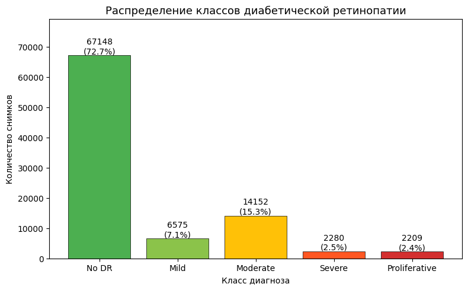
    


    
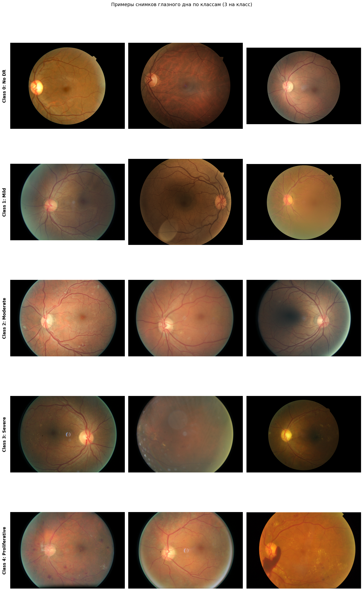
    


**Вывод:** Классы распределены неравномерно — на класс 0 (No DR) приходится 72.7% всех снимков. При оценке модели следует выбирать метрики, устойчивые к дисбалансу классов; при разбивке на выборки (train/val/test) — применять стратификацию.

---

### 4.3.2 Разрешение и aspect ratio


    
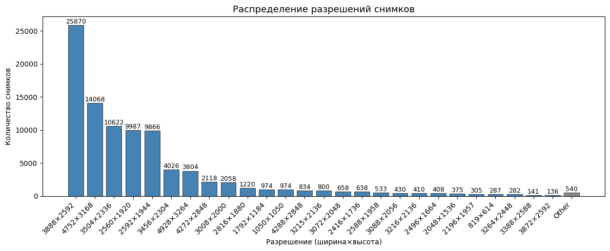
    


    
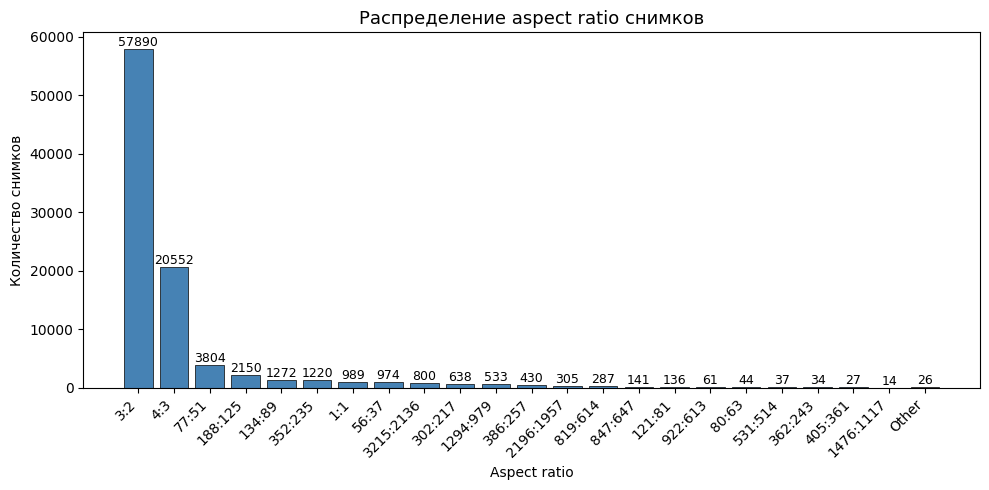
    


**Вывод:** Снимки имеют разные разрешения и aspect ratio, большинство — прямоугольные. Для обучения модели необходимо привести все изображения к единому размеру 512×512. Чтобы не искажать пропорции, используем паддинг: сначала обрезаем чёрный фон по контуру глаза, затем дополняем чёрными полями до квадрата и только потом ресайзим. Снимки, которые уже меньше 512 пикселей, не увеличиваем — апскейл не добавляет информации.

---

### 4.3.3 Яркость и резкость

    
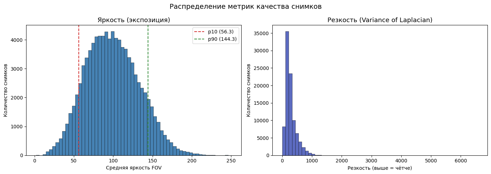
    


    
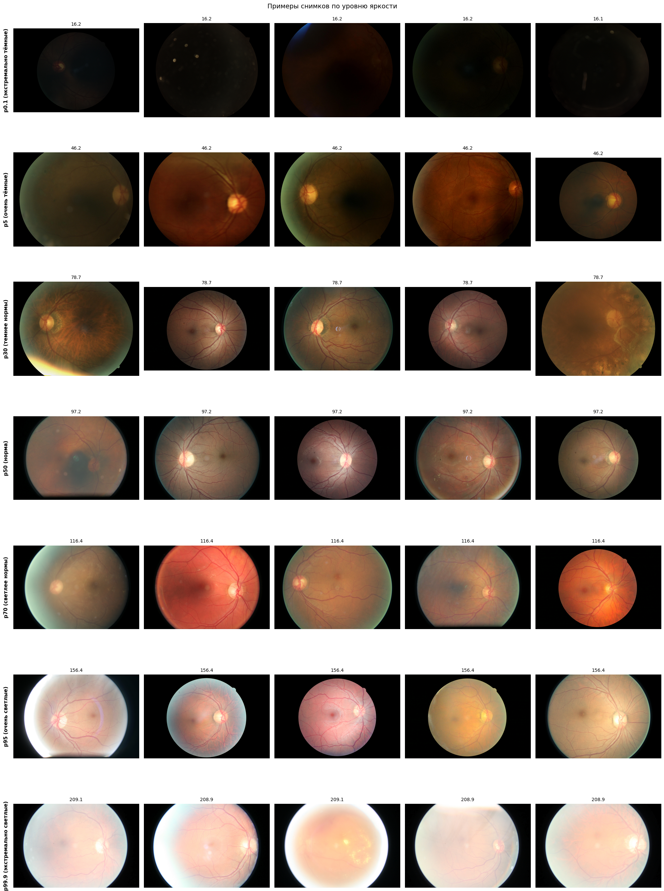
    


    
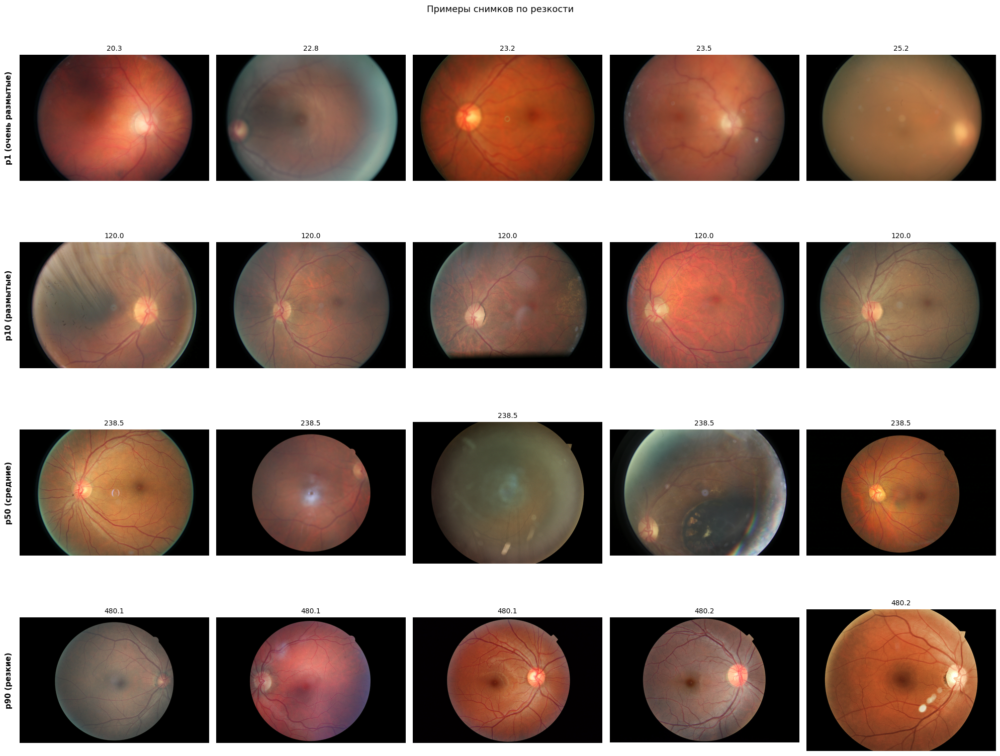
    


**Вывод:** Измерены две метрики фотометрического качества: **яркость** (средняя интенсивность пикселей FOV) и **резкость** (дисперсия лапласиана). Оба показателя имеют широкий разброс: среди снимков есть экстремально тёмные (недоэкспонированные) и экстремально светлые (переэкспонированные), а также выражено размытые. Всё это отражает реальную клиническую практику — оборудование и условия съёмки варьируются от клиники к клинике. Пока все снимки остаются в датасете. В дальнейшем можно провести эксперимент: отфильтровать экстремальные значения по яркости и резкости и проверить, улучшится ли качество модели.

---

### 4.3.4 Другие артефакты

#### Блики


    
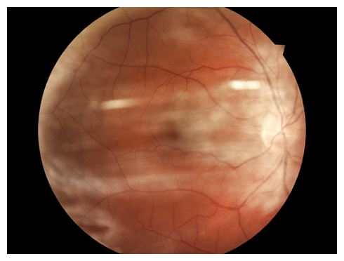
    


---

#### Смещение


    
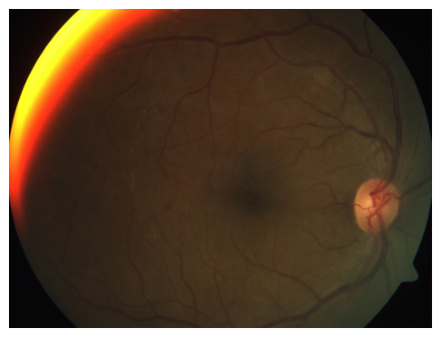
    


---

#### Пятна на объективе


    
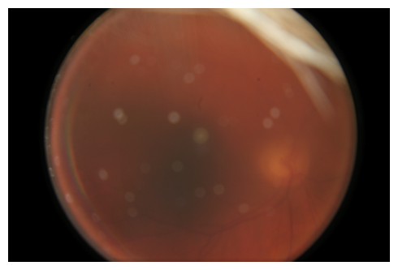
    


**Вывод:** В датасете присутствуют три типа визуальных артефактов: **блики** (отражение вспышки, маскирующее центральные структуры), **смещение** (смаз из-за движения пациента) и **пятна на объективе** (загрязнения линзы, одинаково проявляющиеся на снимках одного устройства). Все три типа встречаются в реальной клинической практике, поэтому снимки остаются в датасете. В дальнейшем можно исследовать, влияет ли их присутствие на качество модели и стоит ли фильтровать наиболее выраженные случаи.

---

## 4.4 Предобработка данных

### 4.4.1 Ресайз снимков до разрешения 512×512 с сохранением aspect ratio


    
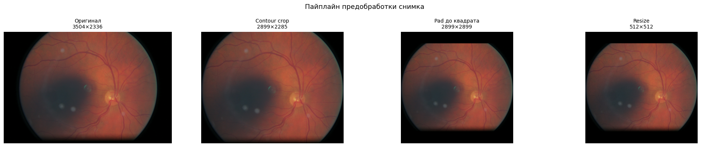

### 4.4.2 Разбиение датасета на train/test

Датасет разбивается в соотношении **80/20** со стратификацией по `diagnosis` — это гарантирует, что распределение классов в train и test совпадает с исходным. Тестовая выборка используется для финальной оценки качества обученной модели.

    Train: 73891 снимков
    Test:  18473 снимков
    
           train   test
    class              
    0      53718  13430
    1       5260   1315
    2      11322   2830
    3       1824    456
    4       1767    442


### 4.4.3 Разбиение train на фолды (кросс-валидация)

Тренировочная выборка разбивается на **5 фолдов** для кросс-валидации. Стратификация по `diagnosis` сохраняет распределение классов в каждом фолде. Каждая итерация кросс-валидации использует 4 фолда для обучения модели и 1 для оценки её качества.

    fold
    0    14779
    1    14778
    2    14778
    3    14778
    4    14778
    
    Итого: 73891 снимков, 5 фолдов


<div>
<style scoped>
    .dataframe tbody tr th:only-of-type {
        vertical-align: middle;
    }

    .dataframe tbody tr th {
        vertical-align: top;
    }

    .dataframe thead th {
        text-align: right;
    }
</style>
<table border="1" class="dataframe">
  <thead>
    <tr style="text-align: right;">
      <th></th>
      <th>id_code</th>
      <th>diagnosis</th>
      <th>fold</th>
    </tr>
  </thead>
  <tbody>
    <tr>
      <th>0</th>
      <td>40887_left</td>
      <td>0</td>
      <td>1</td>
    </tr>
    <tr>
      <th>1</th>
      <td>39661_left</td>
      <td>0</td>
      <td>3</td>
    </tr>
    <tr>
      <th>2</th>
      <td>6374_left</td>
      <td>1</td>
      <td>4</td>
    </tr>
    <tr>
      <th>3</th>
      <td>16596_right</td>
      <td>1</td>
      <td>0</td>
    </tr>
    <tr>
      <th>4</th>
      <td>22285_right</td>
      <td>0</td>
      <td>4</td>
    </tr>
  </tbody>
</table>
</div>


## 4.5 Версионирование данных с DVC

Обработанные снимки и разметка добавляются в DVC
