# 5. Baseline: от сырых данных до первых метрик


```python
import os
from math import gcd
from pathlib import Path

import cv2
import numpy as np
import pandas as pd
import matplotlib.pyplot as plt
from PIL import Image
from sklearn.model_selection import GroupShuffleSplit, StratifiedGroupKFold
from tqdm.auto import tqdm as tqdm_auto
```

## 5.1 Источник и состав данных

В основе проекта — два публичных датасета с соревнований на Kaggle. Каждый содержит снимки глазного дна и разметку к ним:

| Датасет | Год | Снимков train | Снимков test | Разметка train | Разметка test | Формат | Ссылка для скачивания |
|---|---|---|------|---|---------------|---|---|
| DR Detection 2015 | 2015 | 35 126 | 53 576 | ✓ | ✓* | JPEG | [Kaggle](https://www.kaggle.com/competitions/diabetic-retinopathy-detection/data) |
| APTOS 2019 | 2019 | 3 662 | 1928 | ✓ | —** | PNG | [Kaggle](https://www.kaggle.com/competitions/aptos2019-blindness-detection/data) |

*\* Разметку для test DR 2015 можно скачать в [discussion](https://www.kaggle.com/competitions/diabetic-retinopathy-detection/discussion/16149) от организаторов соревнования.*

*\*\* Разметка для test APTOS 2019 организаторами не предоставлялась — снимки исключены из выборки.*

Снимки размечены на 5 классов:

| Класс | Описание                           |
|---|------------------------------------|
| 0 | No DR — норма                      |
| 1 | Mild — легкая                      |
| 2 | Moderate — умеренная               |
| 3 | Severe — тяжелая                   |
| 4 | Proliferative DR — пролиферативная |

---

### Подготовка данных перед запуском ноутбука

**1.** Скачать снимки и поместить в папку `data/raw_images/`:

**2.** Скачать разметку и поместить в папку `data/labels/`. Переименовать в соответствие с таблицей:

| Оригинал                                  | Итоговое имя                 |
|-------------------------------------------|------------------------------|
| `trainLabels.csv` (DR 2015 train)         | `train_2015.csv` |
| `retinopathy_solution.csv` (DR 2015 test) | `test_2015.csv`  |
| `train.csv` (APTOS 2019 train)            | `train_2019.csv` |

**3.** Запустить ячейки ниже — они объединят три файла разметки в единый `data/labels/all.csv`.


```python
test_2015  = pd.read_csv('data/labels/test_2015.csv')
test_2015.head()
```


<div>
<style scoped>
    .dataframe tbody tr th:only-of-type {
        vertical-align: middle;
    }

    .dataframe tbody tr th {
        vertical-align: top;
    }

    .dataframe thead th {
        text-align: right;
    }
</style>
<table border="1" class="dataframe">
  <thead>
    <tr style="text-align: right;">
      <th></th>
      <th>image</th>
      <th>level</th>
      <th>Usage</th>
    </tr>
  </thead>
  <tbody>
    <tr>
      <th>0</th>
      <td>1_left</td>
      <td>0</td>
      <td>Private</td>
    </tr>
    <tr>
      <th>1</th>
      <td>1_right</td>
      <td>0</td>
      <td>Private</td>
    </tr>
    <tr>
      <th>2</th>
      <td>2_left</td>
      <td>0</td>
      <td>Public</td>
    </tr>
    <tr>
      <th>3</th>
      <td>2_right</td>
      <td>0</td>
      <td>Public</td>
    </tr>
    <tr>
      <th>4</th>
      <td>3_left</td>
      <td>2</td>
      <td>Private</td>
    </tr>
  </tbody>
</table>
</div>


```python
train_2015 = pd.read_csv('data/labels/train_2015.csv')
train_2015.head()
```


<div>
<style scoped>
    .dataframe tbody tr th:only-of-type {
        vertical-align: middle;
    }

    .dataframe tbody tr th {
        vertical-align: top;
    }

    .dataframe thead th {
        text-align: right;
    }
</style>
<table border="1" class="dataframe">
  <thead>
    <tr style="text-align: right;">
      <th></th>
      <th>image</th>
      <th>level</th>
    </tr>
  </thead>
  <tbody>
    <tr>
      <th>0</th>
      <td>10_left</td>
      <td>0</td>
    </tr>
    <tr>
      <th>1</th>
      <td>10_right</td>
      <td>0</td>
    </tr>
    <tr>
      <th>2</th>
      <td>13_left</td>
      <td>0</td>
    </tr>
    <tr>
      <th>3</th>
      <td>13_right</td>
      <td>0</td>
    </tr>
    <tr>
      <th>4</th>
      <td>15_left</td>
      <td>1</td>
    </tr>
  </tbody>
</table>
</div>


```python
train_2019 = pd.read_csv('data/labels/train_2019.csv')
train_2019.head()
```


<div>
<style scoped>
    .dataframe tbody tr th:only-of-type {
        vertical-align: middle;
    }

    .dataframe tbody tr th {
        vertical-align: top;
    }

    .dataframe thead th {
        text-align: right;
    }
</style>
<table border="1" class="dataframe">
  <thead>
    <tr style="text-align: right;">
      <th></th>
      <th>id_code</th>
      <th>diagnosis</th>
    </tr>
  </thead>
  <tbody>
    <tr>
      <th>0</th>
      <td>000c1434d8d7</td>
      <td>2</td>
    </tr>
    <tr>
      <th>1</th>
      <td>001639a390f0</td>
      <td>4</td>
    </tr>
    <tr>
      <th>2</th>
      <td>0024cdab0c1e</td>
      <td>1</td>
    </tr>
    <tr>
      <th>3</th>
      <td>002c21358ce6</td>
      <td>0</td>
    </tr>
    <tr>
      <th>4</th>
      <td>005b95c28852</td>
      <td>0</td>
    </tr>
  </tbody>
</table>
</div>


```python
test_2015_clean  = test_2015.rename(columns={'image': 'id_code', 'level': 'diagnosis'})[['id_code', 'diagnosis']]
train_2015_clean = train_2015.rename(columns={'image': 'id_code', 'level': 'diagnosis'})[['id_code', 'diagnosis']]
train_2019_clean = train_2019[['id_code', 'diagnosis']]

df = pd.concat([test_2015_clean, train_2015_clean, train_2019_clean], ignore_index=True)
df.to_csv('data/labels/all.csv', index=False)

df.head()
```


<div>
<style scoped>
    .dataframe tbody tr th:only-of-type {
        vertical-align: middle;
    }

    .dataframe tbody tr th {
        vertical-align: top;
    }

    .dataframe thead th {
        text-align: right;
    }
</style>
<table border="1" class="dataframe">
  <thead>
    <tr style="text-align: right;">
      <th></th>
      <th>id_code</th>
      <th>diagnosis</th>
    </tr>
  </thead>
  <tbody>
    <tr>
      <th>0</th>
      <td>1_left</td>
      <td>0</td>
    </tr>
    <tr>
      <th>1</th>
      <td>1_right</td>
      <td>0</td>
    </tr>
    <tr>
      <th>2</th>
      <td>2_left</td>
      <td>0</td>
    </tr>
    <tr>
      <th>3</th>
      <td>2_right</td>
      <td>0</td>
    </tr>
    <tr>
      <th>4</th>
      <td>3_left</td>
      <td>2</td>
    </tr>
  </tbody>
</table>
</div>


## 5.2 Оценка качества разметки

### 5.2.1 Проверка соответствия снимков и разметки


```python
image_dir = 'data/raw_images'

image_filenames = {p.stem for p in Path(image_dir).iterdir()}
label_filenames = set(df['id_code'])

no_annotation = image_filenames - label_filenames
no_image      = label_filenames - image_filenames

print(f'Снимков на диске:       {len(image_filenames)}')
print(f'Записей в разметке:     {len(label_filenames)}')
print(f'Снимков без разметки:   {len(no_annotation)}')
print(f'Разметка без снимка:    {len(no_image)}')

if no_annotation:
    print('\nСнимки без разметки:', sorted(no_annotation))
if no_image:
    print('\nРазметка без снимков:', sorted(no_image))
```

    Снимков на диске:       92364
    Записей в разметке:     92364
    Снимков без разметки:   0
    Разметка без снимка:    0


**Вывод:** Все снимки на диске имеют соответствующую запись в разметке и наоборот. Датасет полностью согласован.

---

### 5.2.2 Проверка дубликатов


```python
dup_ids = df[df.duplicated(subset='id_code', keep=False)].sort_values('id_code')

exact     = dup_ids[dup_ids.duplicated(subset=['id_code', 'diagnosis'], keep=False)]
conflicts = dup_ids[~dup_ids.duplicated(subset=['id_code', 'diagnosis'], keep=False)]

print(f'Снимков с дублирующейся разметкой: {dup_ids["id_code"].nunique()}')
print(f'  — точные дубликаты (id + разметка совпадают): {exact["id_code"].nunique()}')
print(f'  — конфликтующие метки (один id, разные разметки): {conflicts["id_code"].nunique()}')

if not conflicts.empty:
    print('\nПримеры конфликтов:')
    print(conflicts.head(10).to_string(index=False))
```

    Снимков с дублирующейся разметкой: 0
      — точные дубликаты (id + разметка совпадают): 0
      — конфликтующие метки (один id, разные разметки): 0


**Вывод:** Дубликатов не обнаружено. Разметка технически консистентна.

---

### 5.2.3 Ограничения оценки качества разметки

Проведенные проверки охватывают только **техническую** сторону разметки: полноту, уникальность идентификаторов и согласованность между снимками и CSV. Оценить **медицинскую корректность** разметки — правильность поставленных диагнозов — мы не можем, поскольку это требует профессиональных компетенций врача-офтальмолога. В рамках данного проекта разметка принимается как данность, предоставленная квалифицированными специалистами.

---

## 5.3 EDA

### 5.3.1 Несколько снимков одного пациента


```python
# В DR 2015 id_code выглядит как "10_left" / "10_right" — один пациент, два снимка
dr2015 = df[df['id_code'].str.match(r'.+_(left|right)$')].copy()
dr2015['patient_id'] = dr2015['id_code'].str.rsplit('_', n=1).str[0]

counts = dr2015.groupby('patient_id').size()
both_eyes = counts[counts > 1]

print(f'Пациентов в DR 2015: {dr2015["patient_id"].nunique()}')
print(f'Из них — с снимками левого и правого глаза: {len(both_eyes)} ({len(both_eyes) / dr2015["patient_id"].nunique() * 100:.1f}%)')
```

    Пациентов в DR 2015: 44351
    Из них — с снимками левого и правого глаза: 44351 (100.0%)


**Вывод:** Все пациенты в DR Detection 2015 представлены двумя снимками — левым и правым глазом. Снимки одного пациента визуально похожи: одинаковое качество съемки, схожее состояние сетчатки. Если при разбивке не учитывать это и делить по снимкам, а не по пациентам, один и тот же пациент может попасть одновременно в train и test/validation. Модель будет «видеть» похожие снимки при обучении и при оценке. Это классический пример **утечки данных (data leakage)**, ведущей к переобучению. Чтобы ее исключить, разбивку необходимо делать по пациентам: все снимки одного пациента попадают только в одну из выборок.

---

### 5.3.2 Распределение классов


```python
def find_image(directory, id_code):
    for ext in ('.png', '.jpg', '.jpeg'):
        path = os.path.join(directory, f'{id_code}{ext}')
        if os.path.exists(path):
            return path
    raise FileNotFoundError(f'No image found for {id_code} in {directory}')
```


```python
n_samples = 3
class_labels = {0: 'No DR', 1: 'Mild', 2: 'Moderate', 3: 'Severe', 4: 'Proliferative'}

fig, axes = plt.subplots(5, n_samples, figsize=(n_samples * 5, 5 * 5), dpi=100)
for cls in range(5):
    samples = df[df['diagnosis'] == cls].sample(n_samples, random_state=6)
    for col, (_, row) in enumerate(samples.iterrows()):
        img = Image.open(find_image(image_dir, row['id_code'])).convert('RGB')
        img.thumbnail((224, 224), Image.Resampling.LANCZOS)
        ax = axes[cls][col]
        ax.imshow(img, interpolation='lanczos')
        ax.set_xticks([])
        ax.set_yticks([])
        for spine in ax.spines.values():
            spine.set_visible(False)
        if col == 0:
            ax.set_ylabel(class_labels[cls], fontsize=12, fontweight='bold', labelpad=10)

plt.suptitle('Примеры снимков по классам', fontsize=18)
plt.tight_layout()
plt.show()
```


    
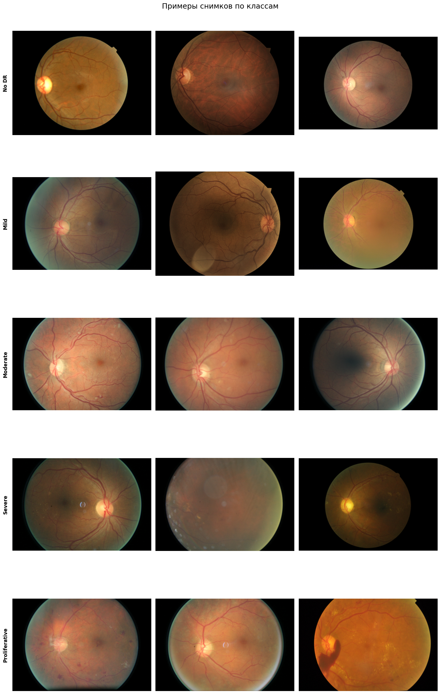
    


```python
counts = df['diagnosis'].value_counts().sort_index()

fig, ax = plt.subplots(figsize=(8, 5))
bars = ax.bar(
    [class_labels[i] for i in counts.index],
    counts.values,
    color=['#4CAF50', '#8BC34A', '#FFC107', '#FF5722', '#D32F2F'],
    edgecolor='black', linewidth=0.5
)

for bar, count in zip(bars, counts.values):
    ax.text(bar.get_x() + bar.get_width() / 2, bar.get_height() + 20,
            f'{count}\n({count/len(df)*100:.1f}%)', ha='center', va='bottom', fontsize=10)

ax.set_title('Распределение классов', fontsize=13)
ax.set_xlabel('Класс')
ax.set_ylabel('Количество снимков')
ax.set_ylim(0, counts.max() * 1.18)
plt.tight_layout()
plt.show()
```


    
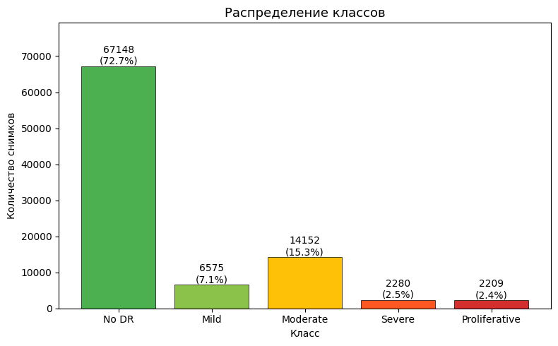
    


**Вывод:** Классы распределены неравномерно — на класс No DR приходится 72.7% всех снимков, тогда как доля некоторых других классов опускается ниже 3%. При оценке модели следует выбирать метрики, устойчивые к дисбалансу классов; при разбивке на выборки (train/val/test) — применять стратификацию.

---

### 5.3.3 Разрешение и aspect ratio


```python
sizes = []
for id_code in tqdm_auto(df['id_code'], desc='Чтение размеров'):
    img = Image.open(find_image(image_dir, id_code))
    sizes.append(img.size)

sizes_df = pd.DataFrame(sizes, columns=['width', 'height'])
size_counts = (sizes_df['width'].astype(str) + '×' + sizes_df['height'].astype(str)).value_counts().sort_values(ascending=False)

threshold = 100
main = size_counts[size_counts >= threshold]
other_count = size_counts[size_counts < threshold].sum()
if other_count > 0:
    main = pd.concat([main, pd.Series({'Other': other_count})])

fig, ax = plt.subplots(figsize=(12, 5))
colors = ['#888888' if k == 'Other' else 'steelblue' for k in main.index]
bars = ax.bar(main.index, main.values, color=colors, edgecolor='black', linewidth=0.5)

for bar, count in zip(bars, main.values):
    ax.text(bar.get_x() + bar.get_width() / 2, bar.get_height() + 5,
            str(count), ha='center', va='bottom', fontsize=9)

ax.set_title('Распределение разрешений снимков', fontsize=13)
ax.set_xlabel('Разрешение (ширина×высота)')
ax.set_ylabel('Количество снимков')
plt.xticks(rotation=45, ha='right')
plt.tight_layout()
plt.show()
```


    Чтение размеров:   0%|          | 0/92364 [00:00<?, ?it/s]


    

    


```python
small = sizes_df[(sizes_df['width'] < 224) | (sizes_df['height'] < 224)]
small_counts = (small['width'].astype(str) + '×' + small['height'].astype(str)).value_counts().sort_values(ascending=False)

print(f'Снимков с разрешением меньше 224×224: {len(small)}')
```

    Снимков с разрешением меньше 224×224: 2


```python
def simplify_ratio(w, h):
    d = gcd(w, h)
    return f"{w//d}:{h//d}"

aspect_counts = sizes_df.apply(lambda r: simplify_ratio(r['width'], r['height']), axis=1).value_counts().sort_values(ascending=False)

threshold = 10
main = aspect_counts[aspect_counts >= threshold]
other_count = aspect_counts[aspect_counts < threshold].sum()
if other_count > 0:
    main = pd.concat([main, pd.Series({'Other': other_count})])

fig, ax = plt.subplots(figsize=(10, 5))
colors = ['#888888' if k == 'Other' else 'steelblue' for k in main.index]
bars = ax.bar(main.index, main.values, color=colors, edgecolor='black', linewidth=0.5)

for bar, count in zip(bars, main.values):
    ax.text(bar.get_x() + bar.get_width() / 2, bar.get_height() + 5,
            str(count), ha='center', va='bottom', fontsize=9)

ax.set_title('Распределение aspect ratio снимков', fontsize=13)
ax.set_xlabel('Aspect ratio')
ax.set_ylabel('Количество снимков')
plt.xticks(rotation=45, ha='right')
plt.tight_layout()
plt.show()
```


    

    


**Вывод:** Снимки имеют разные разрешения и aspect ratio, большинство — прямоугольные. Для обучения моделей необходимо привести все изображения к единому разрешению 224×224. Чтобы не искажать пропорции, используем паддинг: сначала обрезаем черный фон по контуру глаза, затем дополняем черными полями до квадрата и только потом ресайзим. 2 снимка с разрешением меньше 224×224 будут исключены из выборки.

---

### 5.3.4 Яркость и резкость


```python
path_map = {p.stem: str(p) for p in Path(image_dir).iterdir()}

brightness, blur_scores = [], []

for id_code in tqdm_auto(df['id_code'], desc='Анализ снимков'):
    arr = cv2.imread(path_map[id_code], cv2.IMREAD_GRAYSCALE)
    arr = cv2.resize(arr, (224, 224), interpolation=cv2.INTER_AREA)
    mask = arr > 10
    mask_sum = mask.sum()

    brightness.append(arr[mask].mean() if mask_sum > 0 else arr.mean())

    arr_norm = cv2.normalize(arr, np.empty_like(arr), 0.0, 255.0, cv2.NORM_MINMAX).astype(np.uint8)
    lap = cv2.Laplacian(arr_norm, cv2.CV_64F)
    blur_scores.append(lap[mask].var() if mask_sum > 0 else 0)

quality_df = df.copy()
quality_df['brightness'] = brightness
quality_df['blur']       = blur_scores
```


    Анализ снимков:   0%|          | 0/92364 [00:00<?, ?it/s]


```python
p10 = np.percentile(brightness, 10)
p90 = np.percentile(brightness, 90)

fig, axes = plt.subplots(1, 2, figsize=(14, 5))

axes[0].hist(quality_df['brightness'], bins=60, color='steelblue', edgecolor='black', linewidth=0.4)
axes[0].axvline(p10, color='#D32F2F', linestyle='--', linewidth=1.5, label=f'p10 ({p10:.1f})')
axes[0].axvline(p90, color='#388E3C', linestyle='--', linewidth=1.5, label=f'p90 ({p90:.1f})')
axes[0].set_title('Яркость', fontsize=13)
axes[0].set_xlabel('Средняя яркость FOV')
axes[0].set_ylabel('Количество снимков')
axes[0].legend()

axes[1].hist(quality_df['blur'], bins=400, color='#5C6BC0', edgecolor='black', linewidth=0.4)
axes[1].set_title('Резкость', fontsize=13)
axes[1].set_xlabel('Резкость (Variance of Laplacian)')
axes[1].set_ylabel('Количество снимков')
axes[1].set_xlim(left=0, right=1250)

plt.suptitle('Распределение яркости и резкости снимков', fontsize=14)
plt.tight_layout()
plt.show()
```


    
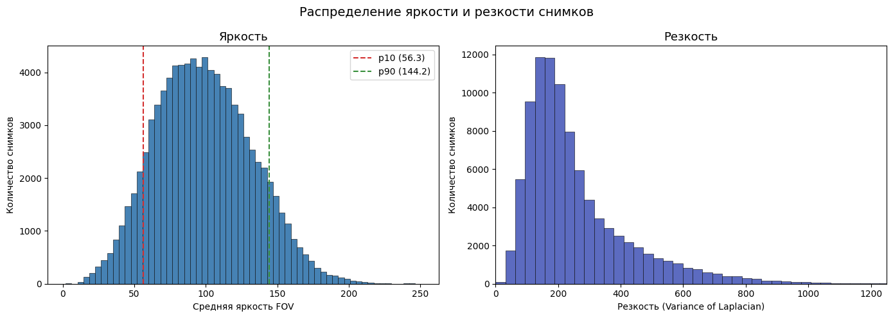
    


```python
quality_df[['brightness','blur']].describe(percentiles=[.01,.05,.95,.99])
```


<div>
<style scoped>
    .dataframe tbody tr th:only-of-type {
        vertical-align: middle;
    }

    .dataframe tbody tr th {
        vertical-align: top;
    }

    .dataframe thead th {
        text-align: right;
    }
</style>
<table border="1" class="dataframe">
  <thead>
    <tr style="text-align: right;">
      <th></th>
      <th>brightness</th>
      <th>blur</th>
    </tr>
  </thead>
  <tbody>
    <tr>
      <th>count</th>
      <td>92364.000000</td>
      <td>92364.000000</td>
    </tr>
    <tr>
      <th>mean</th>
      <td>98.777742</td>
      <td>255.802127</td>
    </tr>
    <tr>
      <th>std</th>
      <td>33.855487</td>
      <td>176.229394</td>
    </tr>
    <tr>
      <th>min</th>
      <td>1.908841</td>
      <td>0.000000</td>
    </tr>
    <tr>
      <th>1%</th>
      <td>29.141834</td>
      <td>52.571838</td>
    </tr>
    <tr>
      <th>5%</th>
      <td>46.178820</td>
      <td>81.887204</td>
    </tr>
    <tr>
      <th>95%</th>
      <td>156.312008</td>
      <td>609.383008</td>
    </tr>
    <tr>
      <th>99%</th>
      <td>180.697513</td>
      <td>841.095711</td>
    </tr>
    <tr>
      <th>max</th>
      <td>250.672644</td>
      <td>12595.599708</td>
    </tr>
  </tbody>
</table>
</div>


```python
n = 5
percentile_groups = [
    ('p0.1 (экстремально темные)',  0.1),
    ('p5 (очень темные)',         5),
    ('p30 (темнее нормы)',        30),
    ('p50 (норма)',               50),
    ('p70 (светлее нормы)',       70),
    ('p95 (очень светлые)',       95),
    ('p99.9 (экстремально светлые)', 99.9),
]

fig, axes = plt.subplots(len(percentile_groups), n, figsize=(n * 4, len(percentile_groups) * 4), dpi=100)

for row_idx, (label, pct) in enumerate(percentile_groups):
    target_val = np.percentile(quality_df['brightness'], pct)
    ids = quality_df.iloc[(quality_df['brightness'] - target_val).abs().argsort()[:n]]['id_code'].values
    for col, id_code in enumerate(ids):
        img = Image.open(find_image(image_dir, id_code)).convert('RGB')
        img.thumbnail((224, 224), Image.Resampling.LANCZOS)
        bv = quality_df.loc[quality_df['id_code'] == id_code, 'brightness'].values[0]
        ax = axes[row_idx][col]
        ax.imshow(img, interpolation='lanczos')
        ax.set_title(f'{bv:.1f}', fontsize=10)
        ax.set_xticks([])
        ax.set_yticks([])
        for spine in ax.spines.values():
            spine.set_visible(False)
    axes[row_idx][0].set_ylabel(label, fontsize=11, fontweight='bold', labelpad=10)

plt.suptitle('Примеры снимков по уровню яркости', fontsize=14)
plt.tight_layout()
plt.show()
```


    
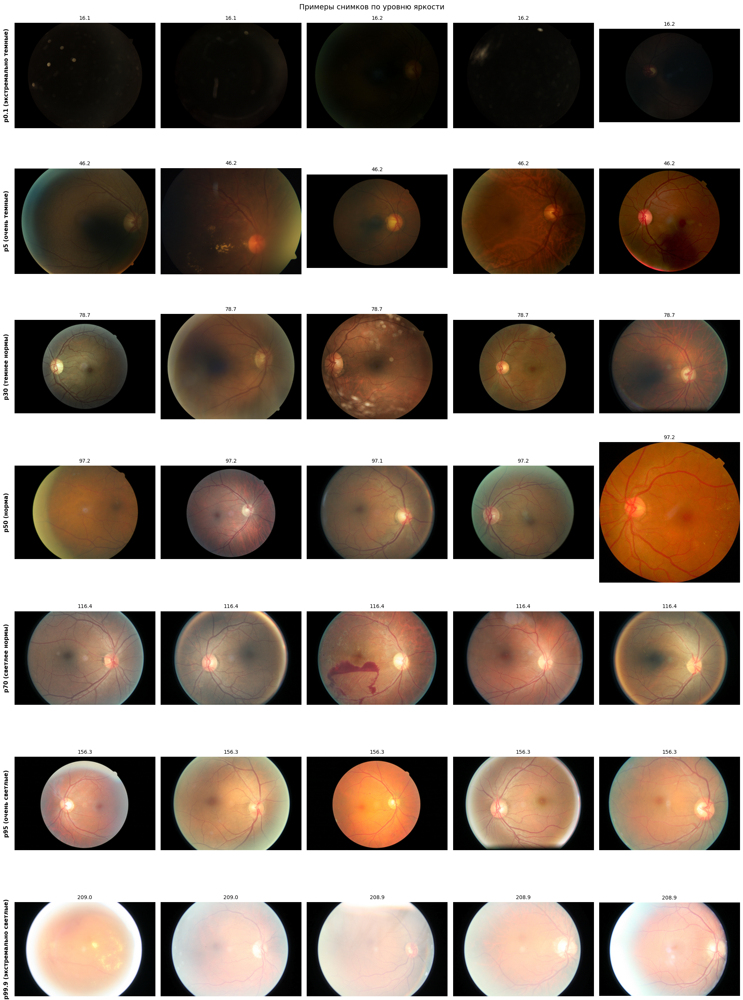
    


```python
n = 5
p30 = np.percentile(quality_df['brightness'], 30)
p70 = np.percentile(quality_df['brightness'], 70)
normal_exp = quality_df[(quality_df['brightness'] >= p30) & (quality_df['brightness'] <= p70)]

blur_groups = [
    ('p1 (очень размытые)',  normal_exp.nsmallest(n, 'blur')['id_code'].values),
    ('p10 (размытые)',       normal_exp.iloc[(normal_exp['blur'] - np.percentile(normal_exp['blur'], 10)).abs().argsort()[:n]]['id_code'].values),
    ('p50 (средние)',        normal_exp.iloc[(normal_exp['blur'] - np.percentile(normal_exp['blur'], 50)).abs().argsort()[:n]]['id_code'].values),
    ('p90 (резкие)',         normal_exp.iloc[(normal_exp['blur'] - np.percentile(normal_exp['blur'], 90)).abs().argsort()[:n]]['id_code'].values),
]
blur_metric = normal_exp.set_index('id_code')['blur']

fig, axes = plt.subplots(len(blur_groups), n, figsize=(n * 4, len(blur_groups) * 4), dpi=100)

for row_idx, (label, ids) in enumerate(blur_groups):
    for col, id_code in enumerate(ids):
        img = Image.open(find_image(image_dir, id_code)).convert('RGB')
        img.thumbnail((224, 224), Image.Resampling.LANCZOS)
        ax = axes[row_idx][col]
        ax.imshow(img, interpolation='lanczos')
        ax.set_title(f'{blur_metric[id_code]:.1f}', fontsize=10)
        ax.set_xticks([])
        ax.set_yticks([])
        for spine in ax.spines.values():
            spine.set_visible(False)
    axes[row_idx][0].set_ylabel(label, fontsize=11, fontweight='bold', labelpad=10)

plt.suptitle('Примеры снимков по резкости', fontsize=18)
plt.tight_layout()
plt.show()
```


    
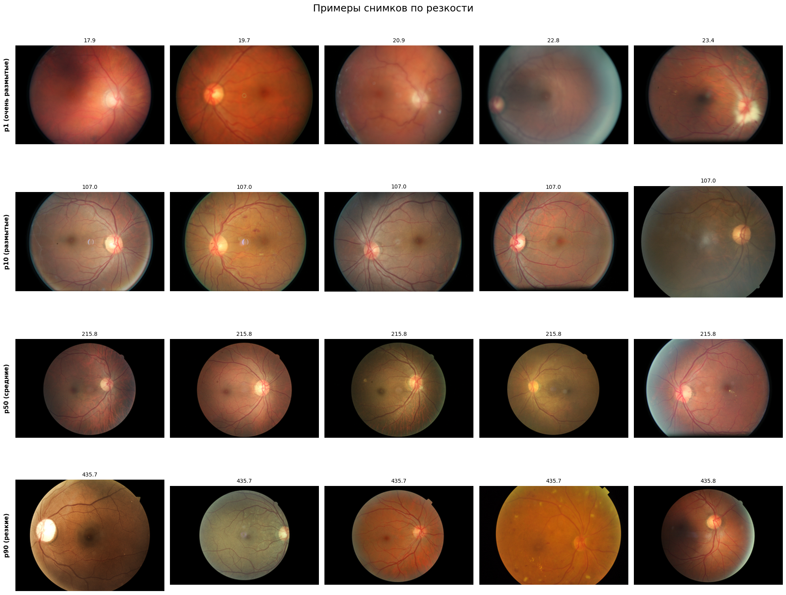
    


**Вывод:** Измерены две метрики фотометрического качества: **яркость** (средняя интенсивность пикселей FOV) и **резкость** (дисперсия лапласиана). Оба показателя имеют широкий разброс: среди снимков есть экстремально темные (недоэкспонированные) и экстремально светлые (переэкспонированные), а также выражено размытые.

Все это отражает реальную клиническую практику — оборудование и условия съемки варьируются от клиники к клинике. Тем не менее явный брак будет исключен из выборки:

| Условие | Причина                                      |
|---|----------------------------------------------|
| `brightness < 20` | Почти черный снимок, структуры неразличимы   |
| `brightness > 210` | Пересвет, детали в светлых областях потеряны |
| `blur < 30` | Нечитаемо размытый снимок                    |

---

### 5.3.5 Другие артефакты

#### Блики


```python
img = Image.open(find_image(image_dir, '44_right')).convert('RGB')
img.thumbnail((224, 224), Image.Resampling.LANCZOS)
plt.figure(figsize=(5, 5))
plt.imshow(img)
plt.axis('off')
plt.tight_layout()
plt.show()
```


    
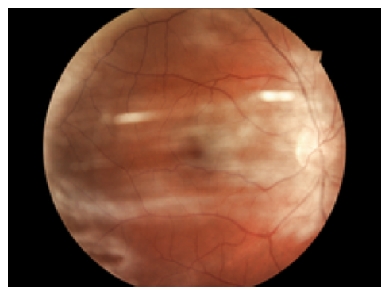
    


---

#### Смещение


```python
img = Image.open(find_image(image_dir, '59ee65760535')).convert('RGB')
img.thumbnail((224, 224), Image.Resampling.LANCZOS)
plt.figure(figsize=(5, 5))
plt.imshow(img)
plt.axis('off')
plt.tight_layout()
plt.show()
```


    
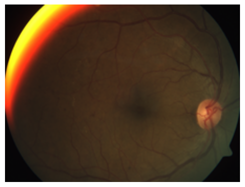
    


---

#### Пятна на объективе


```python
img = Image.open(find_image(image_dir, '1695_left')).convert('RGB')
img.thumbnail((224, 224), Image.Resampling.LANCZOS)
plt.figure(figsize=(5, 5))
plt.imshow(img)
plt.axis('off')
plt.tight_layout()
plt.show()
```


    
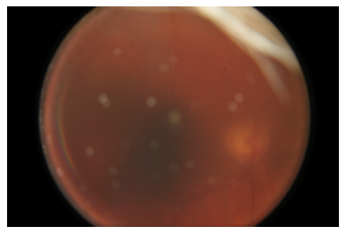
    


**Вывод:** В датасете присутствуют три типа визуальных артефактов: **блики** (отражение вспышки, маскирующее центральные структуры), **смещение** (камера захватила глазное дно со сдвигом, часть анатомических структур вышла за границу кадра) и **пятна на объективе** (загрязнения линзы, одинаково проявляющиеся на снимках одного устройства). Автоматически обнаружить такие артефакты затруднительно, а ручная фильтрация при объеме в 92 000 снимков нецелесообразна — поэтому все снимки остаются в датасете. В перспективе можно попробовать разработать детектор артефактов и проверить, улучшит ли фильтрация качество модели.

---

## 5.4 Предобработка данных

### 5.4.1 Фильтрация снимков с разрешением меньше 224×224


```python
n_before = len(df)

mask_size = (sizes_df['width'] >= 224) & (sizes_df['height'] >= 224)
df       = df[mask_size].reset_index(drop=True)
sizes_df = sizes_df[mask_size].reset_index(drop=True)

print(f'Снимков до фильтрации:    {n_before}')
print(f'Снимков после фильтрации: {len(df)}')
print(f'Удалено: {n_before - len(df)} снимков с разрешением < 224×224')
```

    Снимков до фильтрации:    92364
    Снимков после фильтрации: 92362
    Удалено: 2 снимков с разрешением < 224×224


### 5.4.2 Фильтрация снимков по яркости и резкости


```python
n_before = len(df)

bad_ids = set(quality_df[
    (quality_df['brightness'] < 20) |
    (quality_df['brightness'] > 210) |
    (quality_df['blur'] < 30)
]['id_code'])
df = df[~df['id_code'].isin(bad_ids)].reset_index(drop=True)

print(f'Снимков до фильтрации:    {n_before}')
print(f'Снимков после фильтрации: {len(df)}')
print(f'Удалено: {n_before - len(df)} снимков по критериям яркости/резкости')
```

    Снимков до фильтрации:    92362
    Снимков после фильтрации: 91953
    Удалено: 409 снимков по критериям яркости/резкости


### 5.4.3 Ресайз снимков до разрешения 224×224 с сохранением aspect ratio


```python
def preprocess(path, desired_size=224, return_steps=False):
    img = cv2.imread(path)
    if img is None:
        raise ValueError(f'Cannot read image: {path}')

    steps = [(f'Оригинал\n{img.shape[1]}×{img.shape[0]}', img.copy())] if return_steps else None

    img = cv2.copyMakeBorder(img, 10, 10, 10, 10, cv2.BORDER_CONSTANT, value=[0, 0, 0])
    gray = cv2.cvtColor(img, cv2.COLOR_BGR2GRAY)
    _, mask = cv2.threshold(gray, 10, 255, cv2.THRESH_BINARY)
    contours, _ = cv2.findContours(mask, cv2.RETR_EXTERNAL, cv2.CHAIN_APPROX_SIMPLE)
    if not contours:
        raise ValueError(f'No contours found (image may be entirely black): {path}')
    x, y, w, h = cv2.boundingRect(max(contours, key=cv2.contourArea))
    img = img[y:y+h, x:x+w]

    if return_steps:
        steps.append((f'Contour crop\n{img.shape[1]}×{img.shape[0]}', img.copy()))

    h, w = img.shape[:2]
    side = max(h, w)
    padded = np.zeros((side, side, 3), dtype=np.uint8)
    padded[(side-h)//2:(side-h)//2+h, (side-w)//2:(side-w)//2+w] = img
    img = padded

    if return_steps:
        steps.append((f'Pad до квадрата\n{img.shape[1]}×{img.shape[0]}', img.copy()))

    img = cv2.resize(img, (desired_size, desired_size), interpolation=cv2.INTER_LANCZOS4)

    if return_steps:
        steps.append((f'Resize\n{img.shape[1]}×{img.shape[0]}', img.copy()))
        return img, steps

    return img


sample_path = path_map[df.iloc[0]['id_code']]
_, steps = preprocess(sample_path, return_steps=True)

fig, axes = plt.subplots(1, len(steps), figsize=(len(steps) * 5, 4))
for ax, (title, img) in zip(axes, steps):
    ax.imshow(cv2.cvtColor(img, cv2.COLOR_BGR2RGB))
    ax.set_title(title, fontsize=10)
    ax.axis('off')

plt.suptitle('Пайплайн предобработки снимка', fontsize=13)
plt.tight_layout()
plt.show()
```


    
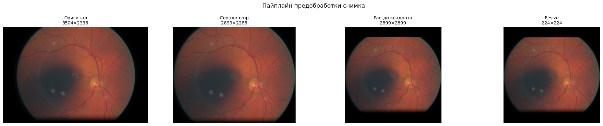
    


```python
processed_dir = 'data/processed_images'
os.makedirs(processed_dir, exist_ok=True)

for id_code in tqdm_auto(df['id_code'], desc='Предобработка'):
    out_path = os.path.join(processed_dir, f'{id_code}.png')
    if not os.path.exists(out_path):
        img = preprocess(path_map[id_code])
        cv2.imwrite(out_path, img)

processed_paths = list(Path(processed_dir).glob('*.png'))
print(f'Снимков в папке:   {len(processed_paths)}')
print(f'Снимков в разметке: {len(df)}')

wrong_size = [p.name for p in processed_paths if cv2.imread(str(p)).shape[:2] != (224, 224)]
if wrong_size:
    print(f'\nСнимков с неверным разрешением: {len(wrong_size)}')
    print(wrong_size[:10])
else:
    print(f'\nВсе снимки имеют разрешение {224}×{224} ✓')
```


    Предобработка:   0%|          | 0/91953 [00:00<?, ?it/s]


    Снимков в папке:   91953
    Снимков в разметке: 91953
    
    Все снимки имеют разрешение 224×224 ✓


### 5.4.4 Разбиение датасета на train/test

Датасет разбивается в соотношении **80/20** по пациентам — все снимки одного пациента попадают только в одну из выборок, чтобы исключить утечку данных. Стратификация по `diagnosis` сохраняется в рамках группового разбиения. Тестовая выборка используется для финальной оценки качества обученных моделей.


```python
# Для DR 2015: "10_left" → patient_id="10". Для APTOS 2019: хэш без суффикса → остаётся как есть
df['patient_id'] = df['id_code'].str.rsplit('_', n=1).apply(
    lambda parts: parts[0] if len(parts) > 1 and parts[1] in ('left', 'right') else '_'.join(parts)
)

gss = GroupShuffleSplit(n_splits=1, test_size=0.2, random_state=42)
train_idx, test_idx = next(gss.split(df, df['diagnosis'], groups=df['patient_id']))

train_df = df.iloc[train_idx].reset_index(drop=True)
test_df  = df.iloc[test_idx].reset_index(drop=True)

train_df.to_csv('data/labels/train.csv', index=False)
test_df.to_csv('data/labels/test.csv', index=False)

print(f'Train: {len(train_df)} снимков ({train_df["patient_id"].nunique()} пациентов)')
print(f'Test:  {len(test_df)} снимков ({test_df["patient_id"].nunique()} пациентов)\n')

train_counts = train_df['diagnosis'].value_counts().sort_index()
test_counts  = test_df['diagnosis'].value_counts().sort_index()

print(pd.DataFrame({
    'train':   train_counts,
    'train %': (train_counts / len(train_df) * 100).round(1),
    'test':    test_counts,
    'test %':  (test_counts  / len(test_df)  * 100).round(1),
}).rename_axis('class'))
```

    Train: 73550 снимков (38364 пациентов)
    Test:  18403 снимков (9591 пациентов)
    
           train  train %   test  test %
    class                               
    0      53509     72.8  13365    72.6
    1       5198      7.1   1362     7.4
    2      11261     15.3   2815    15.3
    3       1828      2.5    429     2.3
    4       1754      2.4    432     2.3


### 5.4.5 Разбиение train на фолды (кросс-валидация)

Тренировочная выборка разбивается на **5 фолдов** по пациентам — пациенты из одного фолда не пересекаются с другими. Стратификация по `diagnosis` сохраняет распределение классов в каждом фолде. Каждая итерация кросс-валидации использует 4 фолда для обучения модели и 1 для оценки ее качества.

*Примечание:* в дальнейшем данный подход может быть пересмотрен, вплоть до использования всей тренировочной выборки для обучения финальной модели.


```python
sgkf = StratifiedGroupKFold(n_splits=5, shuffle=True, random_state=42)

train_df = train_df.reset_index(drop=True)
train_df['fold'] = -1
for fold, (_, val_idx) in enumerate(sgkf.split(train_df, train_df['diagnosis'], groups=train_df['patient_id'])):
    train_df.loc[val_idx, 'fold'] = fold

train_df.to_csv('data/labels/train.csv', index=False)

fold_sizes = train_df.groupby('fold').size().rename('count')
print(fold_sizes.to_string())
print(f'\nИтого: {fold_sizes.sum()} снимков, {len(fold_sizes)} фолдов')
```

    fold
    0    14710
    1    14710
    2    14710
    3    14710
    4    14710
    
    Итого: 73550 снимков, 5 фолдов


```python
train_df.head()
```


<div>
<style scoped>
    .dataframe tbody tr th:only-of-type {
        vertical-align: middle;
    }

    .dataframe tbody tr th {
        vertical-align: top;
    }

    .dataframe thead th {
        text-align: right;
    }
</style>
<table border="1" class="dataframe">
  <thead>
    <tr style="text-align: right;">
      <th></th>
      <th>id_code</th>
      <th>diagnosis</th>
      <th>patient_id</th>
      <th>fold</th>
    </tr>
  </thead>
  <tbody>
    <tr>
      <th>0</th>
      <td>1_left</td>
      <td>0</td>
      <td>1</td>
      <td>2</td>
    </tr>
    <tr>
      <th>1</th>
      <td>1_right</td>
      <td>0</td>
      <td>1</td>
      <td>2</td>
    </tr>
    <tr>
      <th>2</th>
      <td>2_left</td>
      <td>0</td>
      <td>2</td>
      <td>3</td>
    </tr>
    <tr>
      <th>3</th>
      <td>2_right</td>
      <td>0</td>
      <td>2</td>
      <td>3</td>
    </tr>
    <tr>
      <th>4</th>
      <td>4_left</td>
      <td>2</td>
      <td>4</td>
      <td>2</td>
    </tr>
  </tbody>
</table>
</div>


### 5.4.6 Версионирование данных с DVC

Обработанные снимки и разметка добавляются в DVC


```python
!dvc add data/labels/train.csv data/labels/test.csv
```

    /bin/bash: warning: setlocale: LC_ALL: cannot change locale (en_US.UTF-8)
    [?25l⠋ Checking graph
      0% Adding...|              | data/labels/train.csv |0/2 [00:00<?,     ?file/s]
    !
    Collecting files and computing hashes in data/labels/train.csv |0.00 [00:00,    
                                                                                    
    !
      0% Checking cache in '/home/sskrk/PycharmProjects/eye-ai/.dvc/cache/files/md5'
                                                                                    
    !
      0%|          |Adding data/labels/train.csv to cache 0/1 [00:00<?,     ?file/s]
                                                                                    
    !
      0%|          |Checking out /home/sskrk/PycharmProjec0/1 [00:00<?,    ?files/s]
      0% Adding...|               | data/labels/test.csv |0/2 [00:00<?,     ?file/s]
    !
    Collecting files and computing hashes in data/labels/test.csv |0.00 [00:00,     
                                                                                    
    !
      0% Checking cache in '/home/sskrk/PycharmProjects/eye-ai/.dvc/cache/files/md5'
                                                                                    
    !
      0%|          |Adding data/labels/test.csv to cache  0/1 [00:00<?,     ?file/s]
                                                                                    
    !
      0%|          |Checking out /home/sskrk/PycharmProjec0/1 [00:00<?,    ?files/s]
    100% Adding...|████████████████████████████████████████|2/2 [00:00, 50.30file/s]
    
    To track the changes with git, run:
    
    	git add data/labels/train.csv.dvc data/labels/test.csv.dvc
    
    To enable auto staging, run:
    
    	dvc config core.autostage true
    


```python
!dvc add data/processed_images
```

    /bin/bash: warning: setlocale: LC_ALL: cannot change locale (en_US.UTF-8)
    [?25l⠋ Checking graph
    Adding...                                                                       
    !
    Collecting files and computing hashes in data/processed_images |0.00 [00:00,    
    Collecting files and computing hashes in data/processed_images |0.00 [00:00,    
    Collecting files and computing hashes in data/processed_images |0.00 [00:00,    
    Collecting files and computing hashes in data/processed_images |1.01k [00:00, 10
    Collecting files and computing hashes in data/processed_images |2.08k [00:00, 10
    Collecting files and computing hashes in data/processed_images |3.14k [00:00, 10
    Collecting files and computing hashes in data/processed_images |4.22k [00:01, 10
    Collecting files and computing hashes in data/processed_images |5.26k [00:01, 10
    Collecting files and computing hashes in data/processed_images |6.30k [00:01, 10
    Collecting files and computing hashes in data/processed_images |7.38k [00:01, 10
    Collecting files and computing hashes in data/processed_images |8.39k [00:01, 10
    Collecting files and computing hashes in data/processed_images |9.40k [00:01, 10
    Collecting files and computing hashes in data/processed_images |10.4k [00:01, 10
    Collecting files and computing hashes in data/processed_images |11.4k [00:01, 10
    Collecting files and computing hashes in data/processed_images |12.4k [00:01, 9.
    Collecting files and computing hashes in data/processed_images |13.5k [00:01, 9.
    Collecting files and computing hashes in data/processed_images |14.5k [00:02, 9.
    Collecting files and computing hashes in data/processed_images |15.6k [00:02, 9.
    Collecting files and computing hashes in data/processed_images |16.7k [00:02, 10
    Collecting files and computing hashes in data/processed_images |17.7k [00:02, 10
    Collecting files and computing hashes in data/processed_images |18.8k [00:02, 10
    Collecting files and computing hashes in data/processed_images |19.9k [00:02, 10
    Collecting files and computing hashes in data/processed_images |20.9k [00:02, 10
    Collecting files and computing hashes in data/processed_images |22.0k [00:02, 10
    Collecting files and computing hashes in data/processed_images |23.0k [00:02, 10
    Collecting files and computing hashes in data/processed_images |24.0k [00:02, 10
    Collecting files and computing hashes in data/processed_images |25.1k [00:03, 10
    Collecting files and computing hashes in data/processed_images |26.1k [00:03, 10
    Collecting files and computing hashes in data/processed_images |27.2k [00:03, 10
    Collecting files and computing hashes in data/processed_images |28.2k [00:03, 10
    Collecting files and computing hashes in data/processed_images |29.3k [00:03, 10
    Collecting files and computing hashes in data/processed_images |30.4k [00:03, 10
    Collecting files and computing hashes in data/processed_images |31.4k [00:03, 10
    Collecting files and computing hashes in data/processed_images |32.5k [00:03, 10
    Collecting files and computing hashes in data/processed_images |33.5k [00:03, 10
    Collecting files and computing hashes in data/processed_images |34.5k [00:04, 10
    Collecting files and computing hashes in data/processed_images |35.6k [00:04, 10
    Collecting files and computing hashes in data/processed_images |36.7k [00:04, 10
    Collecting files and computing hashes in data/processed_images |37.7k [00:04, 10
    Collecting files and computing hashes in data/processed_images |38.8k [00:04, 10
    Collecting files and computing hashes in data/processed_images |39.9k [00:04, 10
    Collecting files and computing hashes in data/processed_images |41.0k [00:04, 10
    Collecting files and computing hashes in data/processed_images |42.0k [00:04, 10
    Collecting files and computing hashes in data/processed_images |43.1k [00:04, 10
    Collecting files and computing hashes in data/processed_images |44.1k [00:04, 10
    Collecting files and computing hashes in data/processed_images |45.2k [00:05, 8.
    Collecting files and computing hashes in data/processed_images |46.2k [00:05, 9.
    Collecting files and computing hashes in data/processed_images |47.3k [00:05, 9.
    Collecting files and computing hashes in data/processed_images |48.3k [00:05, 9.
    Collecting files and computing hashes in data/processed_images |49.4k [00:05, 10
    Collecting files and computing hashes in data/processed_images |50.4k [00:05, 10
    Collecting files and computing hashes in data/processed_images |51.5k [00:05, 10
    Collecting files and computing hashes in data/processed_images |52.5k [00:05, 10
    Collecting files and computing hashes in data/processed_images |53.6k [00:05, 10
    Collecting files and computing hashes in data/processed_images |54.7k [00:05, 10
    Collecting files and computing hashes in data/processed_images |55.7k [00:06, 10
    Collecting files and computing hashes in data/processed_images |56.8k [00:06, 10
    Collecting files and computing hashes in data/processed_images |57.9k [00:06, 10
    Collecting files and computing hashes in data/processed_images |59.0k [00:06, 10
    Collecting files and computing hashes in data/processed_images |60.0k [00:06, 10
    Collecting files and computing hashes in data/processed_images |61.1k [00:06, 10
    Collecting files and computing hashes in data/processed_images |62.2k [00:06, 10
    Collecting files and computing hashes in data/processed_images |63.3k [00:06, 10
    Collecting files and computing hashes in data/processed_images |64.4k [00:06, 10
    Collecting files and computing hashes in data/processed_images |65.4k [00:06, 10
    Collecting files and computing hashes in data/processed_images |66.6k [00:07, 10
    Collecting files and computing hashes in data/processed_images |67.6k [00:07, 10
    Collecting files and computing hashes in data/processed_images |68.7k [00:07, 10
    Collecting files and computing hashes in data/processed_images |69.8k [00:07, 10
    Collecting files and computing hashes in data/processed_images |70.9k [00:07, 10
    Collecting files and computing hashes in data/processed_images |72.0k [00:07, 10
    Collecting files and computing hashes in data/processed_images |73.1k [00:07, 10
    Collecting files and computing hashes in data/processed_images |74.2k [00:07, 10
    Collecting files and computing hashes in data/processed_images |75.3k [00:07, 10
    Collecting files and computing hashes in data/processed_images |76.4k [00:08, 10
    Collecting files and computing hashes in data/processed_images |77.5k [00:08, 10
    Collecting files and computing hashes in data/processed_images |78.5k [00:08, 10
    Collecting files and computing hashes in data/processed_images |79.6k [00:08, 10
    Collecting files and computing hashes in data/processed_images |80.7k [00:08, 10
    Collecting files and computing hashes in data/processed_images |81.7k [00:08, 10
    Collecting files and computing hashes in data/processed_images |82.8k [00:08, 10
    Collecting files and computing hashes in data/processed_images |83.9k [00:08, 10
    Collecting files and computing hashes in data/processed_images |85.0k [00:08, 10
    Collecting files and computing hashes in data/processed_images |86.1k [00:08, 10
    Collecting files and computing hashes in data/processed_images |87.1k [00:09, 10
    Collecting files and computing hashes in data/processed_images |88.2k [00:09, 8.
    Collecting files and computing hashes in data/processed_images |89.3k [00:09, 9.
    Collecting files and computing hashes in data/processed_images |90.3k [00:09, 9.
    Collecting files and computing hashes in data/processed_images |91.4k [00:09, 9.
                                                                                    
    !
      0% Checking cache in '/home/sskrk/PycharmProjects/eye-ai/.dvc/cache/files/md5'
     25% Querying cache in '/home/sskrk/PycharmProjects/eye-ai/.dvc/cache/files/md5'
     50% Querying cache in '/home/sskrk/PycharmProjects/eye-ai/.dvc/cache/files/md5'
     76% Querying cache in '/home/sskrk/PycharmProjects/eye-ai/.dvc/cache/files/md5'
                                                                                    
    !
      0%|          |Adding data/processed_images to0.00/91.8k [00:00<?,     ?file/s]
      0%|          |Adding data/processed_images to0.00/91.8k [00:00<?,     ?file/s]
      1%|          |Adding data/processed_images729/91.8k [00:00<00:12, 7.29kfile/s]
      2%|▏         |Adding data/processed_imag1.73k/91.8k [00:00<00:10, 8.87kfile/s]
      3%|▎         |Adding data/processed_imag2.75k/91.8k [00:00<00:09, 9.49kfile/s]
      4%|▍         |Adding data/processed_imag3.77k/91.8k [00:00<00:09, 9.75kfile/s]
      5%|▌         |Adding data/processed_imag4.70k/91.8k [00:00<00:09, 9.59kfile/s]
      6%|▌         |Adding data/processed_imag5.66k/91.8k [00:00<00:08, 9.61kfile/s]
      7%|▋         |Adding data/processed_imag6.66k/91.8k [00:00<00:08, 9.74kfile/s]
      8%|▊         |Adding data/processed_imag7.68k/91.8k [00:00<00:08, 9.88kfile/s]
      9%|▉         |Adding data/processed_imag8.65k/91.8k [00:01<00:09, 8.98kfile/s]
     11%|█         |Adding data/processed_imag9.67k/91.8k [00:01<00:08, 9.32kfile/s]
     12%|█▏        |Adding data/processed_imag10.6k/91.8k [00:01<00:08, 9.38kfile/s]
     13%|█▎        |Adding data/processed_imag11.6k/91.8k [00:01<00:08, 9.47kfile/s]
     14%|█▎        |Adding data/processed_imag12.6k/91.8k [00:01<00:08, 9.69kfile/s]
     15%|█▍        |Adding data/processed_imag13.6k/91.8k [00:01<00:07, 9.82kfile/s]
     16%|█▌        |Adding data/processed_imag14.6k/91.8k [00:01<00:07, 9.77kfile/s]
     17%|█▋        |Adding data/processed_imag15.6k/91.8k [00:01<00:07, 9.74kfile/s]
     18%|█▊        |Adding data/processed_imag16.6k/91.8k [00:01<00:07, 9.78kfile/s]
     19%|█▉        |Adding data/processed_imag17.6k/91.8k [00:01<00:07, 9.95kfile/s]
     20%|██        |Adding data/processed_imag18.6k/91.8k [00:02<00:07, 9.83kfile/s]
     21%|██▏       |Adding data/processed_imag19.6k/91.8k [00:02<00:07, 9.89kfile/s]
     22%|██▏       |Adding data/processed_imag20.7k/91.8k [00:02<00:07, 10.0kfile/s]
     24%|██▎       |Adding data/processed_imag21.7k/91.8k [00:02<00:06, 10.2kfile/s]
     25%|██▍       |Adding data/processed_imag22.8k/91.8k [00:02<00:06, 10.3kfile/s]
     26%|██▌       |Adding data/processed_imag23.8k/91.8k [00:02<00:06, 9.81kfile/s]
     27%|██▋       |Adding data/processed_imag24.8k/91.8k [00:02<00:06, 9.72kfile/s]
     28%|██▊       |Adding data/processed_imag25.8k/91.8k [00:02<00:06, 9.77kfile/s]
     29%|██▉       |Adding data/processed_imag26.8k/91.8k [00:02<00:06, 9.90kfile/s]
     30%|███       |Adding data/processed_imag27.8k/91.8k [00:03<00:06, 10.0kfile/s]
     31%|███▏      |Adding data/processed_imag28.8k/91.8k [00:03<00:06, 9.83kfile/s]
     32%|███▏      |Adding data/processed_imag29.8k/91.8k [00:03<00:06, 9.88kfile/s]
     34%|███▎      |Adding data/processed_imag30.8k/91.8k [00:03<00:06, 9.85kfile/s]
     35%|███▍      |Adding data/processed_imag31.8k/91.8k [00:03<00:06, 9.78kfile/s]
     36%|███▌      |Adding data/processed_imag32.8k/91.8k [00:03<00:05, 9.86kfile/s]
     37%|███▋      |Adding data/processed_imag33.8k/91.8k [00:03<00:05, 9.87kfile/s]
     38%|███▊      |Adding data/processed_imag34.8k/91.8k [00:03<00:06, 9.48kfile/s]
     39%|███▉      |Adding data/processed_imag35.7k/91.8k [00:03<00:06, 9.22kfile/s]
     40%|███▉      |Adding data/processed_imag36.7k/91.8k [00:03<00:06, 9.14kfile/s]
     41%|████      |Adding data/processed_imag37.6k/91.8k [00:04<00:06, 8.74kfile/s]
     42%|████▏     |Adding data/processed_imag38.6k/91.8k [00:04<00:05, 9.07kfile/s]
     43%|████▎     |Adding data/processed_imag39.6k/91.8k [00:04<00:05, 9.30kfile/s]
     44%|████▍     |Adding data/processed_imag40.5k/91.8k [00:04<00:05, 9.30kfile/s]
     45%|████▌     |Adding data/processed_imag41.5k/91.8k [00:04<00:05, 9.62kfile/s]
     46%|████▋     |Adding data/processed_imag42.5k/91.8k [00:04<00:05, 9.62kfile/s]
     47%|████▋     |Adding data/processed_imag43.5k/91.8k [00:04<00:04, 9.70kfile/s]
     48%|████▊     |Adding data/processed_imag44.5k/91.8k [00:04<00:05, 9.29kfile/s]
     49%|████▉     |Adding data/processed_imag45.4k/91.8k [00:04<00:05, 9.09kfile/s]
     50%|█████     |Adding data/processed_imag46.3k/91.8k [00:04<00:04, 9.12kfile/s]
     51%|█████▏    |Adding data/processed_imag47.2k/91.8k [00:05<00:05, 8.58kfile/s]
     52%|█████▏    |Adding data/processed_imag48.1k/91.8k [00:05<00:05, 8.11kfile/s]
     53%|█████▎    |Adding data/processed_imag49.0k/91.8k [00:05<00:05, 8.25kfile/s]
     54%|█████▍    |Adding data/processed_imag49.8k/91.8k [00:05<00:05, 7.31kfile/s]
     55%|█████▌    |Adding data/processed_imag50.6k/91.8k [00:05<00:05, 7.42kfile/s]
     56%|█████▌    |Adding data/processed_imag51.3k/91.8k [00:05<00:05, 7.51kfile/s]
     57%|█████▋    |Adding data/processed_imag52.1k/91.8k [00:05<00:05, 7.02kfile/s]
     58%|█████▊    |Adding data/processed_imag52.8k/91.8k [00:05<00:05, 6.59kfile/s]
     58%|█████▊    |Adding data/processed_imag53.5k/91.8k [00:06<00:05, 6.74kfile/s]
     59%|█████▉    |Adding data/processed_imag54.3k/91.8k [00:06<00:05, 6.95kfile/s]
     60%|█████▉    |Adding data/processed_imag55.0k/91.8k [00:06<00:06, 6.10kfile/s]
     61%|██████    |Adding data/processed_imag55.7k/91.8k [00:06<00:05, 6.40kfile/s]
     61%|██████▏   |Adding data/processed_imag56.4k/91.8k [00:06<00:05, 6.54kfile/s]
     62%|██████▏   |Adding data/processed_imag57.1k/91.8k [00:06<00:05, 6.59kfile/s]
     63%|██████▎   |Adding data/processed_imag57.8k/91.8k [00:06<00:05, 5.83kfile/s]
     64%|██████▎   |Adding data/processed_imag58.4k/91.8k [00:06<00:05, 6.06kfile/s]
     64%|██████▍   |Adding data/processed_imag59.1k/91.8k [00:06<00:05, 6.38kfile/s]
     65%|██████▌   |Adding data/processed_imag59.8k/91.8k [00:07<00:04, 6.52kfile/s]
     66%|██████▌   |Adding data/processed_imag60.5k/91.8k [00:07<00:05, 5.67kfile/s]
     67%|██████▋   |Adding data/processed_imag61.2k/91.8k [00:07<00:05, 5.92kfile/s]
     67%|██████▋   |Adding data/processed_imag61.8k/91.8k [00:07<00:04, 6.03kfile/s]
     68%|██████▊   |Adding data/processed_imag62.5k/91.8k [00:07<00:04, 6.24kfile/s]
     69%|██████▊   |Adding data/processed_imag63.1k/91.8k [00:07<00:05, 5.24kfile/s]
     69%|██████▉   |Adding data/processed_imag63.7k/91.8k [00:07<00:05, 5.47kfile/s]
     70%|███████   |Adding data/processed_imag64.3k/91.8k [00:07<00:04, 5.65kfile/s]
     71%|███████   |Adding data/processed_imag65.0k/91.8k [00:07<00:04, 5.80kfile/s]
     71%|███████▏  |Adding data/processed_imag65.6k/91.8k [00:08<00:04, 5.88kfile/s]
     72%|███████▏  |Adding data/processed_imag66.2k/91.8k [00:08<00:05, 5.10kfile/s]
     73%|███████▎  |Adding data/processed_imag66.8k/91.8k [00:08<00:04, 5.30kfile/s]
     73%|███████▎  |Adding data/processed_imag67.3k/91.8k [00:08<00:04, 5.41kfile/s]
     74%|███████▍  |Adding data/processed_imag68.0k/91.8k [00:08<00:04, 5.68kfile/s]
     75%|███████▍  |Adding data/processed_imag68.6k/91.8k [00:08<00:04, 4.90kfile/s]
     75%|███████▌  |Adding data/processed_imag69.2k/91.8k [00:08<00:04, 5.21kfile/s]
     76%|███████▌  |Adding data/processed_imag69.7k/91.8k [00:08<00:04, 5.25kfile/s]
     77%|███████▋  |Adding data/processed_imag70.2k/91.8k [00:09<00:04, 4.90kfile/s]
     77%|███████▋  |Adding data/processed_imag70.8k/91.8k [00:09<00:04, 4.45kfile/s]
     78%|███████▊  |Adding data/processed_imag71.3k/91.8k [00:09<00:04, 4.72kfile/s]
     78%|███████▊  |Adding data/processed_imag71.9k/91.8k [00:09<00:04, 4.96kfile/s]
     79%|███████▉  |Adding data/processed_imag72.4k/91.8k [00:09<00:03, 4.95kfile/s]
     79%|███████▉  |Adding data/processed_imag72.9k/91.8k [00:09<00:04, 4.26kfile/s]
     80%|███████▉  |Adding data/processed_imag73.4k/91.8k [00:09<00:04, 4.50kfile/s]
     81%|████████  |Adding data/processed_imag73.9k/91.8k [00:09<00:03, 4.69kfile/s]
     81%|████████  |Adding data/processed_imag74.4k/91.8k [00:09<00:03, 4.76kfile/s]
     82%|████████▏ |Adding data/processed_imag74.9k/91.8k [00:10<00:03, 4.84kfile/s]
     82%|████████▏ |Adding data/processed_imag75.4k/91.8k [00:10<00:04, 3.99kfile/s]
     83%|████████▎ |Adding data/processed_imag75.9k/91.8k [00:10<00:03, 4.29kfile/s]
     83%|████████▎ |Adding data/processed_imag76.4k/91.8k [00:10<00:03, 4.51kfile/s]
     84%|████████▍ |Adding data/processed_imag76.9k/91.8k [00:10<00:03, 4.59kfile/s]
     84%|████████▍ |Adding data/processed_imag77.4k/91.8k [00:10<00:03, 4.61kfile/s]
     85%|████████▍ |Adding data/processed_imag77.9k/91.8k [00:10<00:03, 4.33kfile/s]
     85%|████████▌ |Adding data/processed_imag78.3k/91.8k [00:10<00:03, 4.10kfile/s]
     86%|████████▌ |Adding data/processed_imag78.8k/91.8k [00:10<00:02, 4.34kfile/s]
     86%|████████▋ |Adding data/processed_imag79.3k/91.8k [00:11<00:02, 4.47kfile/s]
     87%|████████▋ |Adding data/processed_imag79.8k/91.8k [00:11<00:02, 4.47kfile/s]
     87%|████████▋ |Adding data/processed_imag80.2k/91.8k [00:11<00:02, 4.53kfile/s]
     88%|████████▊ |Adding data/processed_imag80.7k/91.8k [00:11<00:02, 3.85kfile/s]
     88%|████████▊ |Adding data/processed_imag81.1k/91.8k [00:11<00:02, 4.06kfile/s]
     89%|████████▉ |Adding data/processed_imag81.6k/91.8k [00:11<00:02, 4.17kfile/s]
     89%|████████▉ |Adding data/processed_imag82.0k/91.8k [00:11<00:02, 4.25kfile/s]
     90%|████████▉ |Adding data/processed_imag82.5k/91.8k [00:11<00:02, 4.33kfile/s]
     90%|█████████ |Adding data/processed_imag82.9k/91.8k [00:11<00:02, 4.37kfile/s]
     91%|█████████ |Adding data/processed_imag83.4k/91.8k [00:12<00:02, 3.83kfile/s]
     91%|█████████ |Adding data/processed_imag83.8k/91.8k [00:12<00:02, 3.73kfile/s]
     92%|█████████▏|Adding data/processed_imag84.2k/91.8k [00:12<00:01, 3.86kfile/s]
     92%|█████████▏|Adding data/processed_imag84.6k/91.8k [00:12<00:01, 4.02kfile/s]
     93%|█████████▎|Adding data/processed_imag85.1k/91.8k [00:12<00:01, 4.13kfile/s]
     93%|█████████▎|Adding data/processed_imag85.5k/91.8k [00:12<00:01, 4.20kfile/s]
     94%|█████████▎|Adding data/processed_imag85.9k/91.8k [00:12<00:01, 4.14kfile/s]
     94%|█████████▍|Adding data/processed_imag86.4k/91.8k [00:12<00:01, 3.49kfile/s]
     95%|█████████▍|Adding data/processed_imag86.8k/91.8k [00:12<00:01, 3.68kfile/s]
     95%|█████████▍|Adding data/processed_imag87.2k/91.8k [00:13<00:01, 3.71kfile/s]
     95%|█████████▌|Adding data/processed_imag87.6k/91.8k [00:13<00:01, 3.80kfile/s]
     96%|█████████▌|Adding data/processed_imag88.0k/91.8k [00:13<00:00, 3.86kfile/s]
     96%|█████████▋|Adding data/processed_imag88.4k/91.8k [00:13<00:00, 3.91kfile/s]
     97%|█████████▋|Adding data/processed_imag88.8k/91.8k [00:13<00:00, 3.27kfile/s]
     97%|█████████▋|Adding data/processed_imag89.2k/91.8k [00:13<00:00, 3.37kfile/s]
     98%|█████████▊|Adding data/processed_imag89.5k/91.8k [00:13<00:00, 3.53kfile/s]
     98%|█████████▊|Adding data/processed_imag89.9k/91.8k [00:13<00:00, 3.64kfile/s]
     98%|█████████▊|Adding data/processed_imag90.4k/91.8k [00:13<00:00, 3.80kfile/s]
     99%|█████████▉|Adding data/processed_imag90.7k/91.8k [00:14<00:00, 3.74kfile/s]
     99%|█████████▉|Adding data/processed_imag91.1k/91.8k [00:14<00:00, 3.17kfile/s]
    100%|█████████▉|Adding data/processed_imag91.5k/91.8k [00:14<00:00, 3.29kfile/s]
                                                                                    
    !
    Checking out /home/sskrk/PycharmProjects/eye-ai/data/processed_images |0.00 [00:
    100% Adding...|████████████████████████████████████████|1/1 [00:28, 28.59s/file]
    
    To track the changes with git, run:
    
    	git add data/processed_images.dvc
    
    To enable auto staging, run:
    
    	dvc config core.autostage true
    


```python
!dvc push
```

    /bin/bash: warning: setlocale: LC_ALL: cannot change locale (en_US.UTF-8)
    Collecting                                          |92.0k [00:02, 31.3kentry/s]
    Pushing
    !
      0% Querying remote cache|                          |0/1 [00:00<?,    ?files/s]
    100% Querying remote cache|█████████████████████|1/1 [00:01<00:00,  1.05s/files]
                                                                                    
    !
      0% Querying remote cache|                          |0/0 [00:00<?,    ?files/s]
                                                                                    
    !
      0% Checking cache in 'a-shihov/files/md5'|         |0/? [00:00<?,    ?files/s]
      0% Estimating size of cache in 'a-shihov/files/md5'| |4096/? [00:00<00:00, 183
                                                                                    
    !
      0% Checking cache in '/home/sskrk/PycharmProjects/eye-ai/.dvc/cache/files/md5'
     27% Querying cache in '/home/sskrk/PycharmProjects/eye-ai/.dvc/cache/files/md5'
     54% Querying cache in '/home/sskrk/PycharmProjects/eye-ai/.dvc/cache/files/md5'
     81% Querying cache in '/home/sskrk/PycharmProjects/eye-ai/.dvc/cache/files/md5'
                                                                                    
    !
      0%|          |Pushing to s3                         0/2 [00:00<?,     ?file/s]
      0%|          |Pushing to s3                         0/2 [00:00<?,     ?file/s]
    
    !
    
      0%|          |/home/sskrk/PycharmProjects/eye-0.00/348k [00:00<?,        ?B/s]
    
    100%|██████████|/home/sskrk/PycharmProjects/348k/348k [00:01<00:00,     291kB/s]
    
                                                                                    
     50%|█████     |Pushing to s3                     1/2 [00:01<00:01,  1.22s/file]
    
    !
    
      0%|          |/home/sskrk/PycharmProjects/eye0.00/1.50M [00:00<?,        ?B/s]
    
    100%|██████████|/home/sskrk/PycharmProject1.50M/1.50M [00:04<00:00,     325kB/s]
    
                                                                                    
    100%|██████████|Pushing to s3                     2/2 [00:06<00:00,  3.35s/file]
    Pushing                                                                         
    2 files pushed
    

## 5.5 Обучение baseline моделей

Для обучения baseline моделей выбраны три архитектуры:

| Модель | Год | Тип архитектуры | Размороженные слои | Всего параметров | Обучаемых параметров |
|---|---|---|---|---|---|
| VGG-19 | 2014 | Классическая CNN | `classifier` + `features[28:]` | ~144M | ~124M |
| ResNet-50 | 2015 | CNN с residual-соединениями | `fc` + `layer4` | ~26M | ~15M |
| Swin-Tiny | 2021 | Vision Transformer (shifted windows) | `head` + `features[-1]` + `norm` | ~28M | ~14M |

Все модели предобучены на ImageNet. Чтобы адаптировать их к задаче (5 классов вместо 1000), заменяется последний слой, затем размораживаются новый классификатор и последний блок backbone — более глубокие слои остаются замороженными.

Параметры обучения:

| Параметр       | Значение                                                           |
|----------------|--------------------------------------------------------------------|
| Оптимизатор    | Adam с дифференциальными LR:<br/>1e-3 (классификатор) / 1e-4 (backbone) |
| Лосс           | CrossEntropyLoss                                                   |
| Батч           | 32                                                                 |
| Максимум эпох  | 20                                                                 |
| Early stopping | 3 эпохи                                                            |
| Фолды          | fold 0                                                             |
| Аугментация    | случайное горизонтальное отражение<br>случайный поворот до 180°<br>случайный сдвиг, масштабирование (±20%) и shear 11.5°<br>случайное изменение яркости, контраста, насыщенности и оттенка<br>размытие по Гауссу с вероятностью 0.5 |

*Early stopping*: обучение прерывается, если val loss не улучшается 3 эпохи подряд; восстанавливаются веса лучшей эпохи.

*Фолды*: из-за ограничений вычислительного лимита Kaggle принято решение проводить обучение модели только на одном фолде.

*Аугментация*: применяется только к тренировочной выборке.


```python
import copy
import os
import torch
import torch.nn as nn
from torch.optim import Adam
from torch.utils.data import Dataset, DataLoader
from torchvision import transforms
from torchvision.io import read_image
from torchvision.models import vgg19, resnet50, swin_t, VGG19_Weights, ResNet50_Weights, Swin_T_Weights
from IPython.display import clear_output
from tqdm import tqdm
import matplotlib.pyplot as plt
import pandas as pd
```


```python
# Дублируем некоторые функции, чтобы можно было запускать ячейки с этого места
def find_image(directory, id_code):
    for ext in ('.png', '.jpg', '.jpeg'):
        path = os.path.join(directory, f'{id_code}{ext}')
        if os.path.exists(path):
            return path
    raise FileNotFoundError(f'No image found for {id_code} in {directory}')


class DRDataset(Dataset):
    def __init__(self, df, image_dir, transform=None):
        self.records = df[['id_code', 'diagnosis']].reset_index(drop=True)
        self.image_dir = image_dir
        self.transform = transform

    def __len__(self):
        return len(self.records)

    def __getitem__(self, idx):
        row = self.records.iloc[idx]
        img = read_image(find_image(self.image_dir, row['id_code']))
        if self.transform:
            img = self.transform(img)
        return img, int(row['diagnosis'])
```


```python
def make_train_transform(weights):
    aug = transforms.Compose([
        transforms.RandomHorizontalFlip(),
        transforms.RandomRotation(180),
        transforms.RandomAffine(degrees=0, translate=(0.2, 0.2), scale=(0.8, 1.2), shear=11.5),
        transforms.ColorJitter(brightness=0.08, contrast=0.2, saturation=0.08, hue=0.028),
        transforms.RandomApply([transforms.GaussianBlur(kernel_size=3)], p=0.5),
    ])
    return transforms.Compose([aug, weights.transforms()])


def train_epoch(model, optimizer, loader, loss_fn):
    model.train()
    total_loss = 0.0
    for x, y in tqdm(loader, desc='Train', leave=False):
        x, y = x.to(device), y.to(device)
        optimizer.zero_grad()
        out = model(x)
        loss = loss_fn(out, y)
        loss.backward()
        optimizer.step()
        total_loss += loss.item()
    return total_loss / len(loader)


@torch.inference_mode()
def evaluate(model, loader, loss_fn):
    model.eval()
    total_loss = 0.0
    for x, y in tqdm(loader, desc='Eval', leave=False):
        x, y = x.to(device), y.to(device)
        out = model(x)
        total_loss += loss_fn(out, y).item()
    return total_loss / len(loader)


def plot_stats(train_loss, valid_loss, title):
    fig, ax = plt.subplots(figsize=(10, 5))
    ax.set_title(f'{title} — Loss')
    ax.plot(train_loss, label='Train')
    ax.plot(valid_loss, label='Valid')
    ax.legend(); ax.grid()
    plt.tight_layout(); plt.show()


def fit(model, optimizer, train_loader, valid_loader, max_epochs, title, loss_fn, early_stopping):
    train_losses, valid_losses = [], []

    best_val_loss = float('inf')
    best_model_state = None
    epochs_without_improvement = 0

    for epoch in range(max_epochs):
        tr_loss = train_epoch(model, optimizer, train_loader, loss_fn)
        vl_loss = evaluate(model, valid_loader, loss_fn)
        train_losses.append(tr_loss)
        valid_losses.append(vl_loss)
        clear_output(wait=True)
        plot_stats(train_losses, valid_losses, title)
        print(f"Epoch {epoch+1}/{max_epochs} | Train Loss {tr_loss:.4f} | Valid Loss {vl_loss:.4f}")

        if vl_loss < best_val_loss:
            best_val_loss = vl_loss
            best_model_state = copy.deepcopy(model.state_dict())
            epochs_without_improvement = 0
        else:
            epochs_without_improvement += 1
            if epochs_without_improvement >= early_stopping:
                print(f"Early stopping на эпохе {epoch+1} (val loss не улучшался {early_stopping} эпох)")
                break

    model.load_state_dict(best_model_state)


def train_cv(
        name,
        weights,
        model,
        optimizer,
        loss_fn,
        train_df_path,
        images_dir,
        models_dir,
        num_cv_folds,
        max_epochs,
        batch_size,
        early_stopping,
):
    train_df = pd.read_csv(train_df_path)

    fname = name.lower().replace('-', '').replace(' ', '_')
    init_model_state = copy.deepcopy(model.state_dict())
    init_optim_state = copy.deepcopy(optimizer.state_dict())

    train_transform = make_train_transform(weights)
    val_transform   = weights.transforms()

    for fold in range(num_cv_folds):
        print(f"\n{'='*40}\n{name} | Fold {fold}\n{'='*40}")

        model.load_state_dict(init_model_state)
        optimizer.load_state_dict(init_optim_state)

        train_fold_df = train_df[train_df['fold'] != fold]
        valid_fold_df = train_df[train_df['fold'] == fold]

        train_loader = DataLoader(DRDataset(train_fold_df, images_dir, train_transform), batch_size=batch_size, shuffle=True,  num_workers=4, pin_memory=True)
        valid_loader = DataLoader(DRDataset(valid_fold_df, images_dir, val_transform),   batch_size=batch_size, shuffle=False, num_workers=4, pin_memory=True)

        fit(model, optimizer, train_loader, valid_loader, max_epochs=max_epochs, title=f'{name} fold {fold}', loss_fn=loss_fn, early_stopping=early_stopping)

        os.makedirs(models_dir, exist_ok=True)
        path = os.path.join(models_dir, f'{fname}_fold{fold}.pth')
        torch.save(model.state_dict(), path)
        print(f"Сохранено: {path}")
```


```python
device = torch.device('cuda:0' if torch.cuda.is_available() else 'cpu')
loss_fn = nn.CrossEntropyLoss()
print(f"Device: {device}")
```

    Device: cuda:0


```python
train_df_path = 'data/labels/train.csv'
images_dir = 'data/processed_images'
models_dir = 'data/models/baseline'
num_cv_folds = 1
max_epochs = 20
batch_size = 32
early_stopping = 3
```

### 5.5.1 VGG-19


```python
vgg_weights = VGG19_Weights.DEFAULT
model_vgg = vgg19(weights=vgg_weights)

# Замораживаем все веса
for p in model_vgg.parameters():
    p.requires_grad = False

# Заменяем последний слой: ImageNet выдавал 1000 классов, нам нужно 5
model_vgg.classifier[6] = nn.Linear(4096, 5)

# Размораживаем классификатор и последний conv-блок (features[28:]) —
# они будут дообучаться под нашу задачу
model_vgg.classifier.requires_grad_(True)
for i in range(28, len(model_vgg.features)):
    for p in model_vgg.features[i].parameters():
        p.requires_grad = True

model_vgg = model_vgg.to(device)

# Дифференциальные LR: новый классификатор учится быстрее,
# предобученные conv-слои — осторожнее, чтобы не сломать выученные признаки
optimizer_vgg = Adam([
    {'params': model_vgg.classifier.parameters(), 'lr': 1e-3},
    {'params': [p for i in range(28, len(model_vgg.features))
                  for p in model_vgg.features[i].parameters()], 'lr': 1e-4},
])

train_cv(
    name='VGG-19',
    weights=vgg_weights,
    model=model_vgg,
    optimizer=optimizer_vgg,
    loss_fn=loss_fn,
    train_df_path=train_df_path,
    images_dir=images_dir,
    models_dir=models_dir,
    num_cv_folds=num_cv_folds,
    max_epochs=max_epochs,
    batch_size=batch_size,
    early_stopping=early_stopping
)
```


    
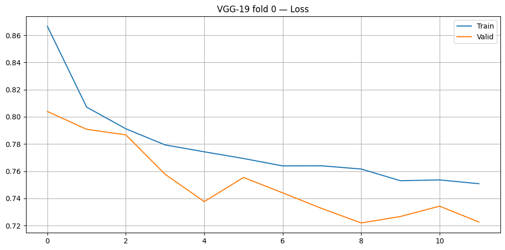
    


    Epoch 12/20 | Train Loss 0.7508 | Valid Loss 0.7226
    Early stopping на эпохе 12 (val loss не улучшался 3 эпох)
    Сохранено: /kaggle/working/models/vgg19_fold0.pth


### 5.5.2 ResNet-50


```python
resnet_weights = ResNet50_Weights.DEFAULT
model_resnet = resnet50(weights=resnet_weights)

# Замораживаем все веса
for p in model_resnet.parameters():
    p.requires_grad = False

# Заменяем последний слой: ImageNet выдавал 1000 классов, нам нужно 5
model_resnet.fc = nn.Linear(2048, 5)

# Размораживаем fc и последний residual-блок (layer4) —
# они будут дообучаться под нашу задачу
model_resnet.fc.requires_grad_(True)
model_resnet.layer4.requires_grad_(True)

model_resnet = model_resnet.to(device)

# Дифференциальные LR: новый классификатор учится быстрее,
# предобученные слои — осторожнее, чтобы не сломать выученные признаки
optimizer_resnet = Adam([
    {'params': model_resnet.fc.parameters(),     'lr': 1e-3},
    {'params': model_resnet.layer4.parameters(), 'lr': 1e-4},
])

train_cv(
    name='ResNet-50',
    weights=resnet_weights,
    model=model_resnet,
    optimizer=optimizer_resnet,
    loss_fn=loss_fn,
    train_df_path=train_df_path,
    images_dir=images_dir,
    models_dir=models_dir,
    num_cv_folds=num_cv_folds,
    max_epochs=max_epochs,
    batch_size=batch_size,
    early_stopping=early_stopping
)
```


    
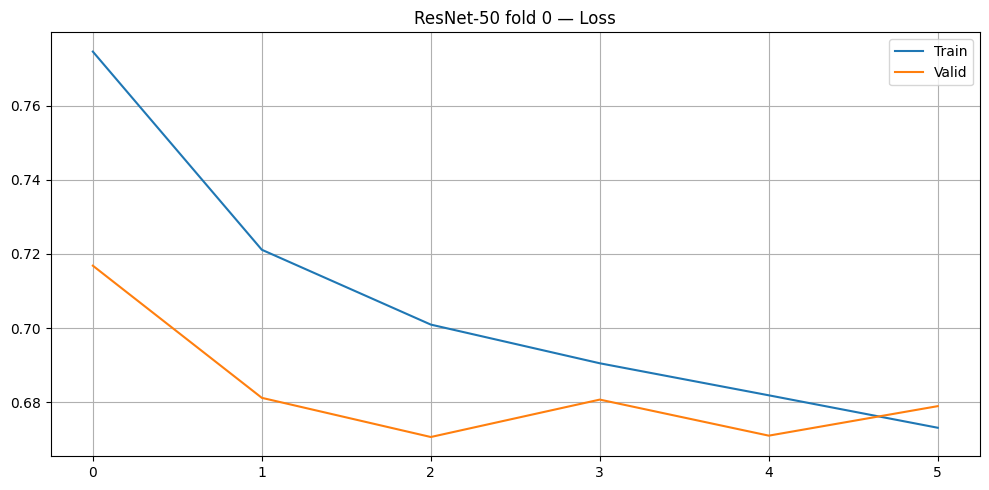
    


    Epoch 6/20 | Train Loss 0.6732 | Valid Loss 0.6790
    Early stopping на эпохе 6 (val loss не улучшался 3 эпох)
    Сохранено: /kaggle/working/models/resnet50_fold0.pth


### 5.5.3 Swin-Tiny


```python
swin_weights = Swin_T_Weights.DEFAULT
model_swin = swin_t(weights=swin_weights)

# Замораживаем все веса
for p in model_swin.parameters():
    p.requires_grad = False

# Заменяем последний слой: ImageNet выдавал 1000 классов, нам нужно 5
model_swin.head = nn.Linear(768, 5)

# Размораживаем head, последний трансформер-блок (features[-1]) и нормализацию (norm) —
# они будут дообучаться под нашу задачу
model_swin.head.requires_grad_(True)
model_swin.features[-1].requires_grad_(True)
model_swin.norm.requires_grad_(True)

model_swin = model_swin.to(device)

# Дифференциальные LR: новый классификатор учится быстрее,
# предобученные слои — осторожнее, чтобы не сломать выученные признаки
optimizer_swin = Adam([
    {'params': model_swin.head.parameters(), 'lr': 1e-3},
    {'params': list(model_swin.features[-1].parameters()) +
               list(model_swin.norm.parameters()), 'lr': 1e-4},
])

train_cv(
    name='Swin-T',
    weights=swin_weights,
    model=model_swin,
    optimizer=optimizer_swin,
    loss_fn=loss_fn,
    train_df_path=train_df_path,
    images_dir=images_dir,
    models_dir=models_dir,
    num_cv_folds=num_cv_folds,
    max_epochs=max_epochs,
    batch_size=batch_size,
    early_stopping=early_stopping
)
```


    
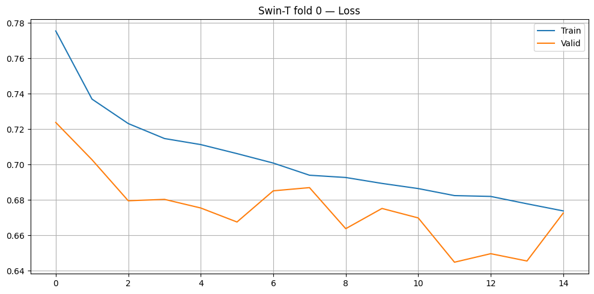
    


    Epoch 15/20 | Train Loss 0.6738 | Valid Loss 0.6726
    Early stopping на эпохе 15 (val loss не улучшался 3 эпох)
    Сохранено: /kaggle/working/models/swint_fold0.pth


### 5.5.4 Версионирование baseline моделей с DVC

Обученные чекпоинты добавляются в DVC


```python
!dvc add models/
```


```python
!dvc push
```

## 5.6 Оценка качества baseline моделей

Для оценки качества моделей выбраны пять метрик, учитывающих как ординальность классов DR, так и дисбаланс выборки.

| Метрика | Описание                                                                                                                 |
|---|--------------------------------------------------------------------------------------------------------------------------|
| **QWK** (Quadratic Weighted Kappa) | Взвешенная мера согласия между предсказаниями и разметкой; ошибки на далеких классах штрафуются сильнее, чем на соседних |
| **AUC** (macro OvR) | Площадь под ROC-кривой в схеме one-vs-rest; не зависит от порога классификации, усредняется по классам                   |
| **Precision** (macro) | Доля верно предсказанных примеров среди всех предсказанных для данного класса; macro-среднее по классам                  |
| **Recall** (macro) | Доля верно найденных примеров среди всех реальных примеров класса; macro-среднее по классам                              |
| **F1** (macro) | Гармоническое среднее Precision и Recall; macro-среднее по классам                                                       |


```python
import os
import torch
import torch.nn as nn
import torch.nn.functional as F
import numpy as np
import pandas as pd
import matplotlib.pyplot as plt
from torch.utils.data import DataLoader
from torchvision.io import read_image
from torchvision.models import vgg19, resnet50, swin_t, VGG19_Weights, ResNet50_Weights, Swin_T_Weights
from tqdm import tqdm
from sklearn.metrics import (
    cohen_kappa_score, roc_auc_score,
    precision_score, recall_score, f1_score,
    confusion_matrix, ConfusionMatrixDisplay,
)
```


```python
# Дублируем некоторые функции, чтобы можно было запускать ячейки с этого места
def find_image(directory, id_code):
    for ext in ('.png', '.jpg', '.jpeg'):
        path = os.path.join(directory, f'{id_code}{ext}')
        if os.path.exists(path):
            return path
    raise FileNotFoundError(f'No image found for {id_code} in {directory}')


class DRDataset(torch.utils.data.Dataset):
    def __init__(self, df, image_dir, transform=None):
        self.records = df[['id_code', 'diagnosis']].reset_index(drop=True)
        self.image_dir = image_dir
        self.transform = transform

    def __len__(self):
        return len(self.records)

    def __getitem__(self, idx):
        row = self.records.iloc[idx]
        img = read_image(find_image(self.image_dir, row['id_code']))
        if self.transform:
            img = self.transform(img)
        return img, int(row['diagnosis'])
```


```python
def _make_vgg19():
    w = VGG19_Weights.DEFAULT
    m = vgg19(weights=None)
    m.classifier[6] = nn.Linear(4096, 5)
    return m, w

def _make_resnet50():
    w = ResNet50_Weights.DEFAULT
    m = resnet50(weights=None)
    m.fc = nn.Linear(2048, 5)
    return m, w

def _make_swin_t():
    w = Swin_T_Weights.DEFAULT
    m = swin_t(weights=None)
    m.head = nn.Linear(768, 5)
    return m, w

model_registry = [
    ('VGG-19',    'vgg19',    _make_vgg19),
    ('ResNet-50', 'resnet50', _make_resnet50),
    ('Swin-T',    'swint',    _make_swin_t),
]
```


```python
train_df_path = 'data/labels/train.csv'
test_df_path = 'data/labels/test.csv'
images_dir = 'data/processed_images'
models_dir = 'data/models/baseline'

device = torch.device('cuda:0' if torch.cuda.is_available() else 'cpu')
print(f'Device: {device}')
```

    Device: cuda:0


```python
@torch.inference_mode()
def get_predictions(model, loader, desc='Inference'):
    model.eval()
    all_probs, all_preds, all_labels = [], [], []
    for x, y in tqdm(loader, desc=desc, leave=True):
        x = x.to(device)
        logits = model(x)
        probs = F.softmax(logits, dim=1).cpu().numpy()
        all_probs.append(probs)
        all_preds.append(logits.argmax(dim=1).cpu().numpy())
        all_labels.append(y.numpy())
    probs_out  = np.concatenate(all_probs)
    preds_out  = np.concatenate(all_preds)
    labels_out = np.concatenate(all_labels)
    print(f'  [{desc}] samples processed: {len(preds_out)}')
    return probs_out, preds_out, labels_out


def compute_metrics(y_true, y_pred, y_probs):
    return {
        'QWK':       cohen_kappa_score(y_true, y_pred, weights='quadratic'),
        'AUC':       roc_auc_score(y_true, y_probs, multi_class='ovr', average='macro'),
        'Precision': precision_score(y_true, y_pred, average='macro', zero_division=0),
        'Recall':    recall_score(y_true, y_pred, average='macro', zero_division=0),
        'F1':        f1_score(y_true, y_pred, average='macro', zero_division=0),
    }
```


```python
train_df_full = pd.read_csv(train_df_path)
test_df_eval  = pd.read_csv(test_df_path)

print(f'Val (fold {0}) size: {len(train_df_full[train_df_full["fold"] == 0])}')
print(f'Test size:           {len(test_df_eval)}\n')

FOLD = 0
results = {}

for name, fname, model_fn in model_registry:
    print(f"\n{'='*40}\n{name}\n{'='*40}")

    model, weights = model_fn()
    ckpt_path = os.path.join(models_dir, f'{fname}_fold{FOLD}.pth')
    model.load_state_dict(torch.load(ckpt_path, map_location=device))
    model = model.to(device)

    val_transform = weights.transforms()

    val_df = train_df_full[train_df_full['fold'] == FOLD]
    val_loader  = DataLoader(DRDataset(val_df,       images_dir, val_transform), batch_size=64, shuffle=False, num_workers=4, pin_memory=True)
    test_loader = DataLoader(DRDataset(test_df_eval, images_dir, val_transform), batch_size=64, shuffle=False, num_workers=4, pin_memory=True)

    val_probs,  val_preds,  val_labels  = get_predictions(model, val_loader,  desc=f'{name} val')
    test_probs, test_preds, test_labels = get_predictions(model, test_loader, desc=f'{name} test')

    results[name] = {
        'val':         compute_metrics(val_labels,  val_preds,  val_probs),
        'test':        compute_metrics(test_labels, test_preds, test_probs),
        'test_preds':  test_preds,
        'test_labels': test_labels,
    }

    print(f"  QWK  val={results[name]['val']['QWK']:.4f}  test={results[name]['test']['QWK']:.4f}")
    print(f"  AUC  val={results[name]['val']['AUC']:.4f}  test={results[name]['test']['AUC']:.4f}")
```

    Val (fold 0) size: 14710
    Test size:           18403
    
    
    ========================================
    VGG-19
    ========================================


    VGG-19 val: 100%|██████████| 230/230 [01:30<00:00,  2.54it/s]


      [VGG-19 val] samples processed: 14710


    VGG-19 test: 100%|██████████| 288/288 [02:07<00:00,  2.26it/s]


      [VGG-19 test] samples processed: 18403
      QWK  val=0.4598  test=0.4539
      AUC  val=0.7754  test=0.7777
    
    ========================================
    ResNet-50
    ========================================


    ResNet-50 val: 100%|██████████| 230/230 [00:51<00:00,  4.49it/s]


      [ResNet-50 val] samples processed: 14710


    ResNet-50 test: 100%|██████████| 288/288 [01:04<00:00,  4.48it/s]


      [ResNet-50 test] samples processed: 18403
      QWK  val=0.5983  test=0.5821
      AUC  val=0.8206  test=0.8173
    
    ========================================
    Swin-T
    ========================================


    Swin-T val: 100%|██████████| 230/230 [01:19<00:00,  2.88it/s]


      [Swin-T val] samples processed: 14710


    Swin-T test: 100%|██████████| 288/288 [01:39<00:00,  2.90it/s]

      [Swin-T test] samples processed: 18403
      QWK  val=0.6070  test=0.5864
      AUC  val=0.8354  test=0.8280


    


```python
metric_cols = ['QWK', 'AUC', 'Precision', 'Recall', 'F1']

rows = []
for name in results:
    for split in ('val', 'test'):
        row = {'Model': name, 'Split': split}
        row.update(results[name][split])
        rows.append(row)

comparison_df = pd.DataFrame(rows).set_index(['Model', 'Split'])[metric_cols]

cell_text = [[f'{v:.4f}' for v in row] for row in comparison_df.values]
row_labels = [f'{m} / {s}' for m, s in comparison_df.index]

fig, ax = plt.subplots(figsize=(10, 2.5))
ax.axis('off')

table = ax.table(
    cellText=cell_text,
    rowLabels=row_labels,
    colLabels=metric_cols,
    cellLoc='center',
    loc='center',
)
table.auto_set_font_size(False)
table.set_fontsize(10)
table.scale(1, 1.6)

is_test = comparison_df.index.get_level_values('Split') == 'test'
for j, col in enumerate(metric_cols):
    best_val = comparison_df.loc[is_test, col].max()
    for i, (idx, val) in enumerate(zip(comparison_df.index, comparison_df[col])):
        if idx[1] == 'test' and val == best_val:
            table[i + 1, j].set_facecolor('#d4edda')

plt.tight_layout()
plt.show()
```


    
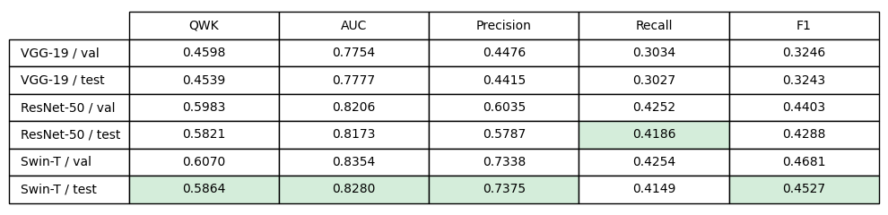
    


```python
class_labels = {0: 'No DR', 1: 'Mild', 2: 'Moderate', 3: 'Severe', 4: 'Proliferative'}

fig, axes = plt.subplots(1, 3, figsize=(18, 5))
for ax, (name, _, _) in zip(axes, model_registry):
    cm = confusion_matrix(results[name]['test_labels'], results[name]['test_preds'])
    disp = ConfusionMatrixDisplay(confusion_matrix=cm, display_labels=[class_labels[i] for i in range(5)])
    disp.plot(ax=ax, colorbar=False, cmap='Blues')
    ax.set_title(name, fontsize=13)
    ax.tick_params(axis='x', rotation=45)

plt.suptitle('Confusion Matrix — Test set', fontsize=14)
plt.tight_layout()
plt.show()
```


    
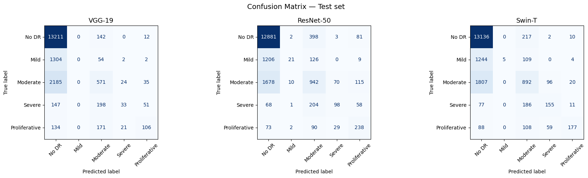
    


**Вывод:** Лучший результат среди baseline моделей показал Swin-T (QWK=0.5864), незначительно опережая ResNet-50 (QWK=0.5821). VGG-19 заметно отстаёт (QWK=0.4539). Все три модели обучены без оптимизаций, поэтому текущие результаты следует рассматривать как нижнюю оценку достижимого качества.


---

## 5.7 Направления для оптимизации

**Данные**

- **Более агрессивная фильтрация по яркости и резкости**: текущие пороги (`brightness < 20`, `brightness > 210`, `blur < 30`) отсекают только явный брак. Ужесточение порогов позволит убрать снимки низкого качества, которые затрудняют обучение и могут ухудшать метрики.
- **Обучение на полной тренировочной выборке**: вместо одного фолда использовать весь train целиком. Модель обучится на 20% большем объеме данных, что особенно важно для редких классов.
- **Undersampling доминирующего класса**: класс No DR составляет ~73% выборки. Уменьшение его доли до уровня остальных классов может помочь модели лучше распознавать редкие классы.
- **Оптимизация аугментации**: текущий набор подобран без экспериментов. Поскольку val loss ниже train loss, аугментации могут быть избыточно агрессивными — их смягчение стоит рассмотреть в первую очередь.

**Архитектура моделей**

- **Расширение пула архитектур**: выбор архитектуры существенно влияет на качество. Стоит расширить эксперимент, включив больше CNN, ViT, а также гибридных моделей.
- **Более глубокое размораживание backbone**: сейчас размораживается только последний блок каждой модели. Постепенное размораживание дополнительных слоев может позволить модели адаптировать больше признаков под специфику снимков глазного дна.

**Обучение**

- **Loss с весами классов**: присвоить редким классам больший вес в функции потерь, чтобы ошибки на них штрафовались сильнее.
- **SmoothL1Loss**: переформулировать задачу как регрессию на метки 0–4 и округлять предсказание до ближайшего класса. В отличие от CrossEntropyLoss, штрафует дальние ошибки сильнее близких — что соответствует ординальной природе DR.
- **Подбор гиперпараметров**: learning rate, batch size и scheduler выставлены вручную без оптимизации. Автоматический подбор — один из наиболее очевидных резервов роста качества.
