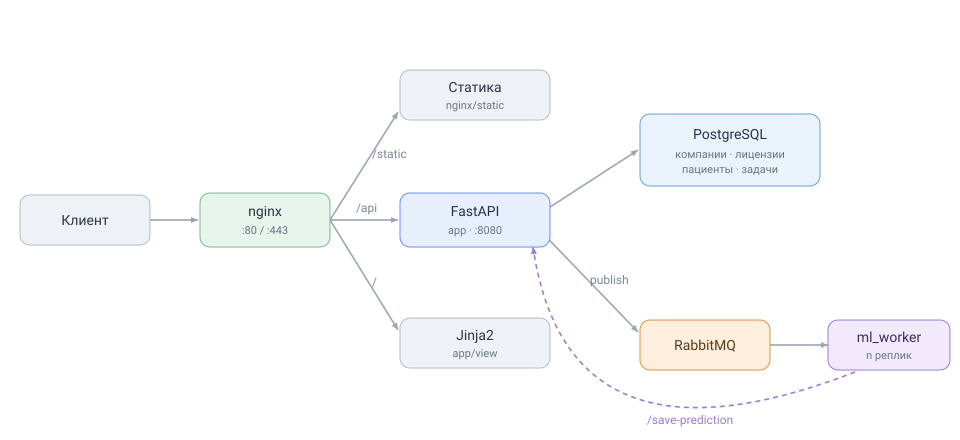

# Eye AI

Сервис автоматического скрининга диабетической ретинопатии по снимкам глазного дна.

---

## Архитектура



---

## Конфигурация

### `.env`


```env
# Учетные данные PostgreSQL (контейнер БД)
POSTGRES_USER=
POSTGRES_PASSWORD=
POSTGRES_DB=

# Учетные данные RabbitMQ (контейнер брокера)
RABBITMQ_USER=
RABBITMQ_PASS=

# Число реплик ml_worker
ML_WORKER_REPLICAS=
```

### `app/.env`

```env
# База данных PostgreSQL
DB_HOST=
DB_PORT=
DB_USER=
DB_PASS=
DB_NAME=

# Документация Swagger
APP_NAME=
APP_DESCRIPTION=
API_VERSION=

# Приложение
DEBUG=                   # True/False — отладочный режим (логи SQL и пр.)
APP_ENV=                 # dev/prod; при dev схема БД пересоздается и заполняется тестовыми данными
AUTH_SECRET_KEY=         # секрет для подписи пользовательских JWT
AUTH_COOKIE_NAME=        # имя cookie с токеном авторизации

# RabbitMQ — публикация ML-задач в очередь
RMQ_HOST=
RMQ_PORT=
RMQ_USER=
RMQ_PASS=
RMQ_QUEUE=

# Межсервисный JWT — общий секрет с воркером (должен совпадать в обоих файлах)
S2S_SECRET_KEY=

# Тестовый админ (APP_ENV=dev)
TEST_ADMIN_EMAIL=
TEST_ADMIN_USERNAME=
TEST_ADMIN_PASSWORD=
TEST_ADMIN_COMPANY=
TEST_ADMIN_FIRST_NAME=
TEST_ADMIN_LAST_NAME=
```

### `ml_worker/.env`

```env
# RabbitMQ — потребление ML-задач из очереди
RMQ_HOST=
RMQ_PORT=
RMQ_USER=
RMQ_PASS=
RMQ_QUEUE=

# Связь с API: URL и общий S2S-секрет (совпадает с app/.env)
APP_URL=
S2S_SECRET_KEY=

# ML-модель: путь к чекпойнту
MODEL_PATH=

# Клинические пороги стадий ДР
THRESHOLD_MILD_DR=
THRESHOLD_MODERATE_DR=
THRESHOLD_SEVERE_DR=
THRESHOLD_PROLIFERATIVE_DR=
```

---

## Запуск приложения

Перед первым запуском сгенерировать self-signed сертификат для localhost (nginx ждет его в `nginx/ssl/`):

```bash
openssl req -x509 -nodes -days 365 -newkey rsa:2048 \
  -keyout nginx/ssl/localhost.key \
  -out nginx/ssl/localhost.crt \
  -subj "/CN=localhost"
```

Сборка и запуск всех сервисов:

```bash
docker compose up --build
```

| Сервис | Адрес |
|--------|-------|
| Web UI | `http://localhost/` |
| Swagger | `http://localhost/api/docs` |
| RabbitMQ UI | `http://localhost:15672` |

---

## Тесты
```bash
docker exec -w /app ml-service-api python -m pytest tests -vv
```

## Линтер

```bash
docker exec -w /app ml-service-api python -m flake8 .
```


---

## Роли пользователей

| Роль | Возможности |
|------|-------------|
| `user` | Запуск скрининга, просмотр задач, добавление пациентов, внесение врачебного заключения |
| `company_admin` | Все из `user` + управление пользователями компании |
| `super_admin` | Управление лицензиями всех компаний |